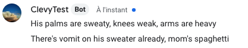
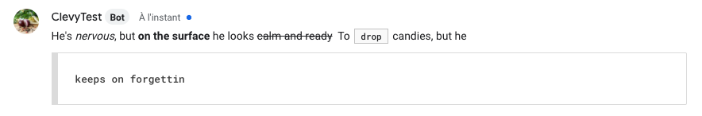
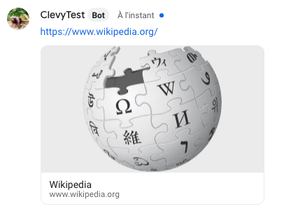
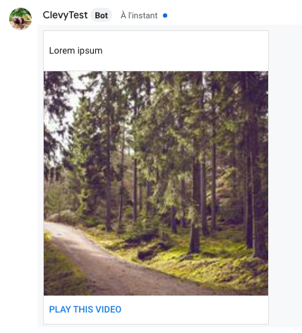
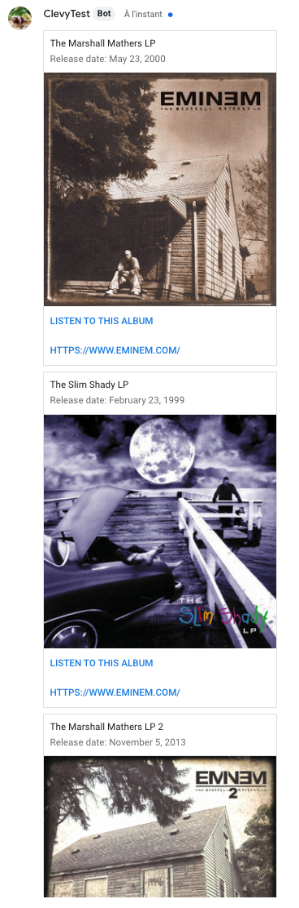
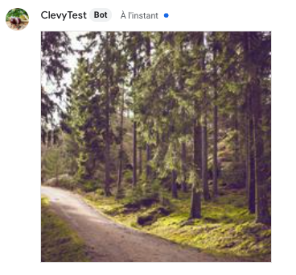

# Features

## Text

Google Chat lets you format text. So you can either use regular text or formatted text:

```cpp
say "His palms are sweaty, knees weak, arms are heavy" // short form
say Text("There's vomit on his sweater already, mom's spaghetti") // long form

/**
 * Text formatting:
 * bold: * before and after text.
 * italic: _ before and after text.
 * stripe: ~ before and after text.
 * integrated code block: ` before and after text.
 * multiline code block: ``` before and after text.
 */

say "He's _nervous_, but *on the surface* he looks ~calm and ready~  To `drop` candies, but he ```keeps on forgettin```" 

```





## Typing, Wait

Google Chat does not have a typing indicator. Typings are simply interpreted as delays.

## Url, Audio, File

Google Chat unfurls URLs and displays a preview of the content of the page. For instance:

```cpp
say Url("https://www.wikipedia.org/")
```



Google does not provide a way to display an audio player or to upload a file from the bot. These components will be rendered as simple Urls.

## Image

```cpp
say Image("https://picsum.photos/200")
```


## Video

In some cases, Google Chat will be able to automatically display a video player in the conversation. This is obviously the case with Youtube videos, but it also works with some other players.


In other cases, you can add some optional parameters to the video to wrap it and render it better:

* `title` - the title that will appear on the video card
* `thumbnail_url` - the url to the thumbnail image
* `button`  - the clickable button to open the video

```cpp
say Video("https://www.youtube.com/watch?v=CS58YQaVIaA")
say Video(
  "https://www.learningcontainer.com/wp-content/uploads/2020/05/sample-mp4-file.mp4",
  title="Lorem ipsum",
  button=Button("Play this video"),
  thumbnail_url="https://picsum.photos/200"
)

```



## Carousel, Card

There is no concept of `Carousel` in Google Chat, but cards can be stacked vertically. When using a Carousel component, this is the end result:

```cpp

do card1 = Card(
  "The Marshall Mathers LP",
  subtitle="Release date: May 23, 2000",
  image_url="https://upload.wikimedia.org/wikipedia/en/a/ae/The_Marshall_Mathers_LP.jpg",
  default_action=Url("https://www.eminem.com/"),
  buttons=[
      Button("Listen to this album", payload="marshallmatherslp1"),
      Url("https://www.eminem.com/", text="Visit eminem.com"),
  ]
)
do card2 = Card(
  "The Slim Shady LP",
  subtitle="Release date: February 23, 1999",
  image_url="https://upload.wikimedia.org/wikipedia/en/3/35/Eminem_-_The_Slim_Shady_LP_CD_cover.jpg",
  default_action=Url("https://www.eminem.com/"),
  buttons=[
      Button("Listen to this album", payload="theslimshadylp"),
      Url("https://www.eminem.com/", text="Visit eminem.com"),
  ]
)
do card3 = Card(
  "The Marshall Mathers LP 2",
  subtitle="Release date: November 5, 2013",
  image_url="https://upload.wikimedia.org/wikipedia/en/8/87/The_Marshall_Mathers_LP_2.png",
  default_action=Url("https://www.eminem.com/"),
  buttons=[
      Button("Listen to this album", payload="marshallmatherslp2"),
  Url("https://www.eminem.com/", text="Visit eminem.com"),
  ]
)

say Carousel(cards=[card1, card2, card3])
```



## Raw objects

You can send any valid message as per [Google Chat's API reference](https://developers.google.com/hangouts/chat/reference/message-formats/basic) as a raw object:

```cpp
say {
  "cards": [{
    "header": { "imageUrl": "https://picsum.photos/200" },
    "sections": {
      "widgets": [{
        "image": {
          "imageUrl": "https://picsum.photos/200",
        },
      }],
    },
  }],
}
```

This example renders a raw image:



## Slash Commands

In the Google Chat configuration panel, you can setup slash commands for your bot. These are nice ways to force trigger a CSML flow.

To setup a slash command, you need to create the command like so:


Then, in the AI Rules panel in CSML Studio, add a rule for this command triggering a specific flow:


When the command is used, the specified flow will be triggered with the following payload:

```javascript
{
    "payload": "/mycommand",
    "text": "This is some text",
    "payload_type": "SLASH_COMMAND",
    "original_text": "/mycommand This is some text"
}
```

## Event Metadata

A sample `_metadata`  for an incoming event will be similar to the following object:

```javascript
{
    "email": "john.doe@company.com",
    "first_name": "John",
    "last_name": "Doe",
    "name": "John Doe",
    "_channel": {
        "name": "My Channel",
        "type": "googlechat"
    }
}


```

