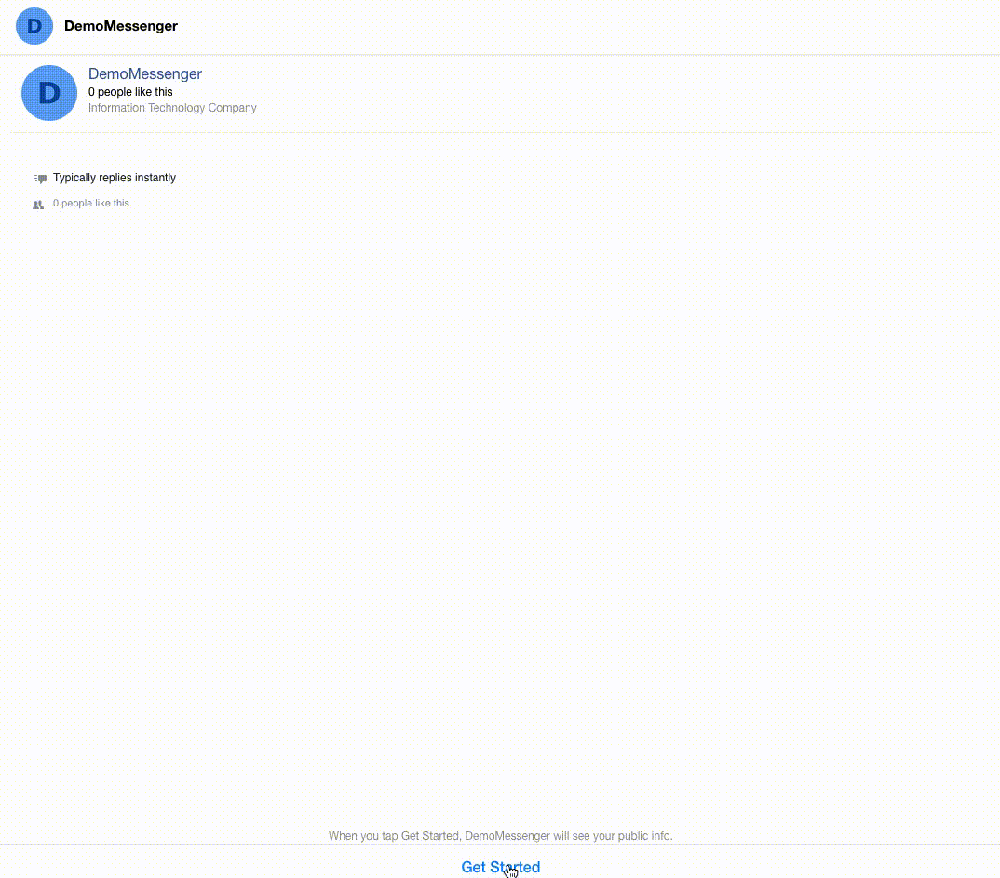
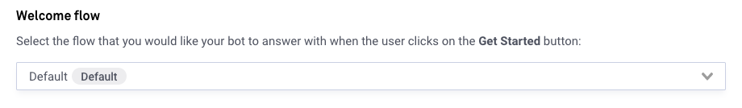
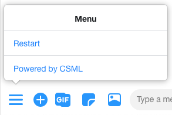
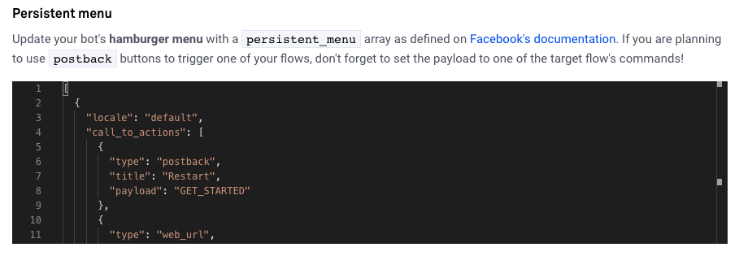

# Configuration

The Messenger channel on CSML Studio offers some configuration options. More will be added over time!

### Welcome flow

When a user starts using your bot, the first thing they will see is a Get Started button \(the text will be automatically translated in their own configured language and can not be changed\). In the background, a `"GET_STARTED"` payload is sent to the bot.

This setting helps you configure which flow will be triggered by this specific payload. By default it will be the bot's default flow, but you might want to have a different behavior for what happens when users connect to your bot for the very first time \(or when they have deleted the conversation before and want to start anew\).

To configure a welcome flow, simply select it in the dropdown list the flow you want to run when the user clicks on the Get Started button.

### Persistent Menu

Messenger makes it possible to add a [persistent menu](https://developers.facebook.com/docs/messenger-platform/send-messages/persistent-menu/#the-persistent-menu) to your bots. 

We offer a simple way to set precisely the persistent menu you want, by letting you add a JSON-formatted payload to set as the bot's persistent menu. Any valid persistent menu configuration is accepted.

