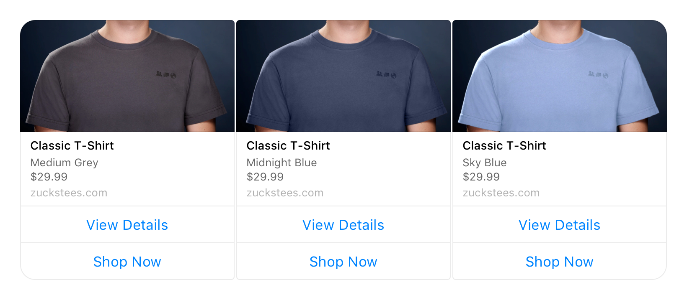

# Features

## Available components

Messenger channel supports all CSML components: `Text`, `Typing`, `Wait`, `Image`, `Question`, `Button`, `Carousel`, `Card`, `Audio`, `Video`, `Url`, `File`.

## Special behaviors

### Thumb up event

A "thumb up" button click is interpreted as a special Payload component event. CSML will receive the following data:

```javascript
{
  "content_type": "payload",
  "content": { "payload": ":like:" },
}
```

### Buttons and quick replies

Messenger differentiates between several types of buttons. Currently, CSML Studio will allow you to send either [regular](https://developers.facebook.com/docs/messenger-platform/send-messages/buttons) or [quick\_reply](https://developers.facebook.com/docs/messenger-platform/send-messages/quick-replies) buttons.

Regular buttons are larger elements, and remain on screen after the user has clicked on them. Quick replies will display just above the user input and disappear once clicked. You can also fit more `quick_reply` buttons \(13\) than regular buttons \(3\) per event.

To send quick\_reply events, use the following syntax:

```cpp
say Question(
    "Is it:",
    buttons=[Button("a bird"), Button("a plane"), Button("Superman")],
    button_type="quick_reply"
)
```

There are several types of [quick\_reply buttons](https://developers.facebook.com/docs/messenger-platform/reference/buttons/quick-replies/#quick_reply). You can play with the `type` and `image_url` attributes. By default, quick\_reply buttons are of type `text`. The requirements/limitations defined in Facebook's documentation apply.


### Carousel

Messenger provides a Carousel format which is quite interesting for some use cases. It allows for horizontal scrolling of one or several Cards, each having the ability to display an optional image and up to 3 buttons.

It is perfect as a menu for selecting what to do next!



Messenger's Carousel is a slightly specialized version of CSML's Carousel component: it has the same default parameters but additional options are available:

```cpp
do card1 = Card(
    "Classic T-Shirt",
    image_url="https://petersfancybrownhats.com/company_image.png",
    subtitle="Medium Grey",
    default_action=Url("https://zuckstees.com"),
    buttons=[Button("View Details"), Url("https://zuckstees.com", text="Shop Now")],
)
do card2 = Card(
    "Classic T-Shirt",
    image_url="https://petersfancybrownhats.com/company_image.png",
    subtitle="Midnight Blue",
    default_action=Url("https://zuckstees.com"),
    buttons=[Button("View Details"), Url("https://zuckstees.com", text="Shop Now")],
)
do card3 = Card(
    "Classic T-Shirt",
    image_url="https://petersfancybrownhats.com/company_image.png",
    subtitle="Sky Blue",
    default_action=Url("https://zuckstees.com"),
    buttons=[Button("View Details"), Url("https://zuckstees.com", text="Shop Now")],
)

say Carousel(cards=[card1, card2, card3])
```

### Raw objects

Some behaviors are currently unmatched with CSML components. The coverage for messenger templates will grow over time, however, please note that if you need to send a very specific template, you can always send the raw Messenger-formatted object.

For example, whilst CSML does not \(yet\) cover Airline Templates for Messenger, you can always send a raw [Check-In Template](https://developers.facebook.com/docs/messenger-platform/send-messages/template/airline/#check_in) object if you need it:

```cpp
say {
  "attachment": {
    "type": "template",
    "payload": {
      "template_type": "airline_checkin",
      "intro_message": "Check-in is available now.",
      "locale": "en_US",        
      "pnr_number": "ABCDEF",
      "checkin_url": "https:\/\/www.airline.com\/check-in",  
      "flight_info": [
        {
          "flight_number": "f001",
          "departure_airport": {
            "airport_code": "SFO",
            "city": "San Francisco",
            "terminal": "T4",
            "gate": "G8"
          },
          "arrival_airport": {
            "airport_code": "SEA",
            "city": "Seattle",
            "terminal": "T4",
            "gate": "G8"
          },
          "flight_schedule": {
            "boarding_time": "2016-01-05T15:05",
            "departure_time": "2016-01-05T15:45",
            "arrival_time": "2016-01-05T17:30"
          }
        }
      ]
    }
  }
}
```

## Broadcast

Messenger supports [broadcasts](../../api/api-reference/broadcasts-api.md), with some important caveats. You should read carefully what the limitations are on [Facebook's documentation](https://developers.facebook.com/docs/messenger-platform/policy/policy-overview). In short:

* You can send any message that you want to any user that previously sent a message to the bot in the last 24 hours
* Messages must be sent exclusively to the app-scoped user ID \(you can not send a broadcast using the user's email address for example\)
* After this 24-hours window, you must include one of the valid [message tags](https://developers.facebook.com/docs/messenger-platform/send-messages/message-tags) in your request. This is done by adding a `"message_tag":"TAG_NAME"` in the metadata of the request, as shown below:



**Failing to respect this rule may get your chatbot and/or page banned from facebook!**


## Limitations

In general, all Messenger limitations apply. For example, texts can not be larger than 2000 UTF-8 characters, and attachment sizes \(Videos, Audio, Files\) can not be larger than 25MB.

Regular buttons are limited to 3 per single event, while quick\_reply buttons allow up to 13 buttons. The length of the button title should also never be longer than 20 characters.

### Single Button Components

Messenger requires buttons to have an accompanying text. The following CSML code will display an error message in the conversation, as a `Button` can not be used alone:

```cpp
say Button("Click me!")
```

You should always use a `Question` component instead:

```cpp
say Question(
    "What happens now?",
    buttons = [Button("Click me!")]
)
```

### Fallbacks

* Files that are larger than 25MB will be sent as simple text instead of uploaded as attachments
* Nice URLs are unavailable. They will display as simple text instead
* Youtube/Dailymotion/Vimeo videos as well as Spotify/Deezer/Soundcloud audios will display as simple text
* URL Buttons are currently unsupported natively \(use raw objects for now\)

### Notifications

Due to [the recent changes](https://developers.facebook.com/blog/post/2019/08/29/messenger-launches-new-tools-to-drive-more-valuable-conversations-between-people-and-businesses/) in the way Messenger handles sending notifications to your users, CSML Studio does not allow sending messages to users except for the regular use case of responding directly to a request the user made \(by sending a text message, clicking a button, etc.\). To send one-way notifications \(or broadcasts\) to your users, you need to build your own separate logic.

