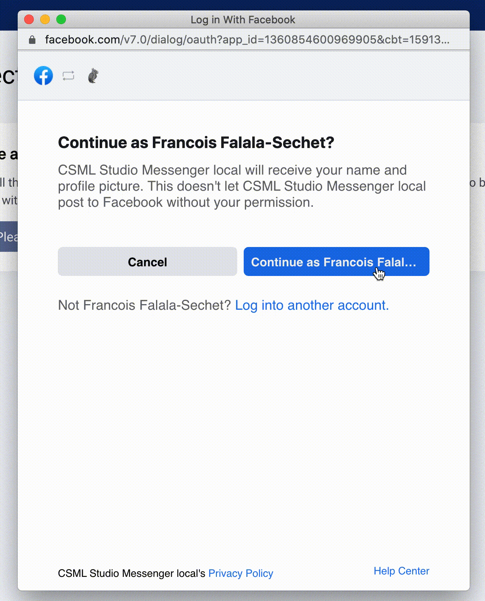
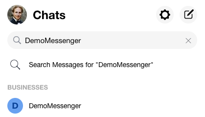
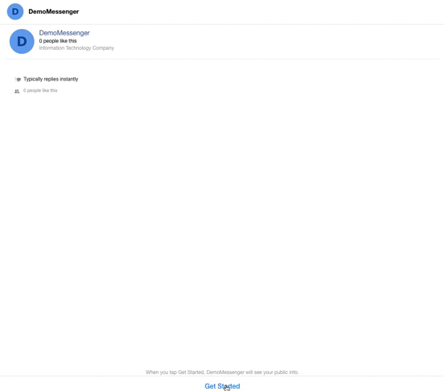

# Installation

There are several prerequisites to building a Messenger chatbot, which we will assume are already taken care of. Before we start, please make sure that you already have:

* an active Facebook account
* a Facebook page for your chatbot to be associated with that you are an admin of
* a CSML chatbot ready to go

## 1. Login with facebook

In CSML Studio, visit **Channels &gt; Connect new channel &gt; Messenger**. Click on **Continue with Facebook** to grant permissions to CSML Studio to connect bots to your chosen pages. This starts a standard Facebook login flow:

After this, simply select the page you want to link to the bot, and wait a few seconds.

Voilà! You can now search for your chatbot in Facebook Messenger \(it will be listed under the page's name\).

