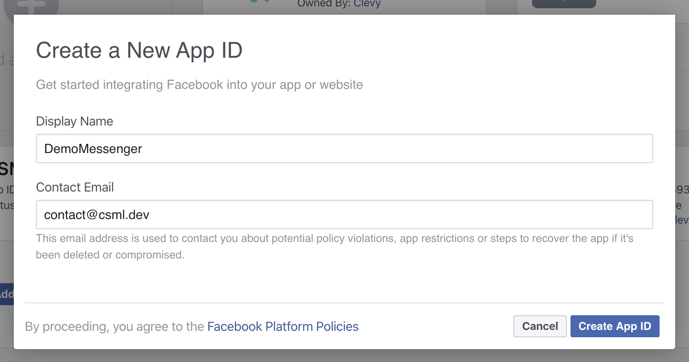
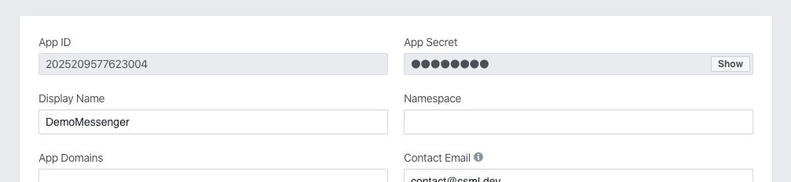
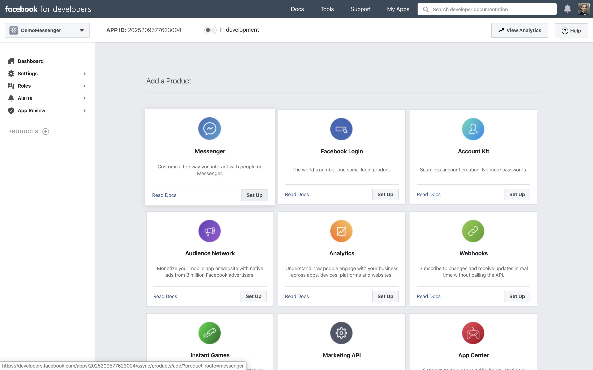
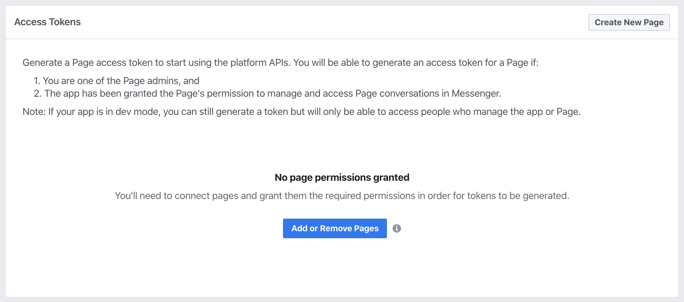
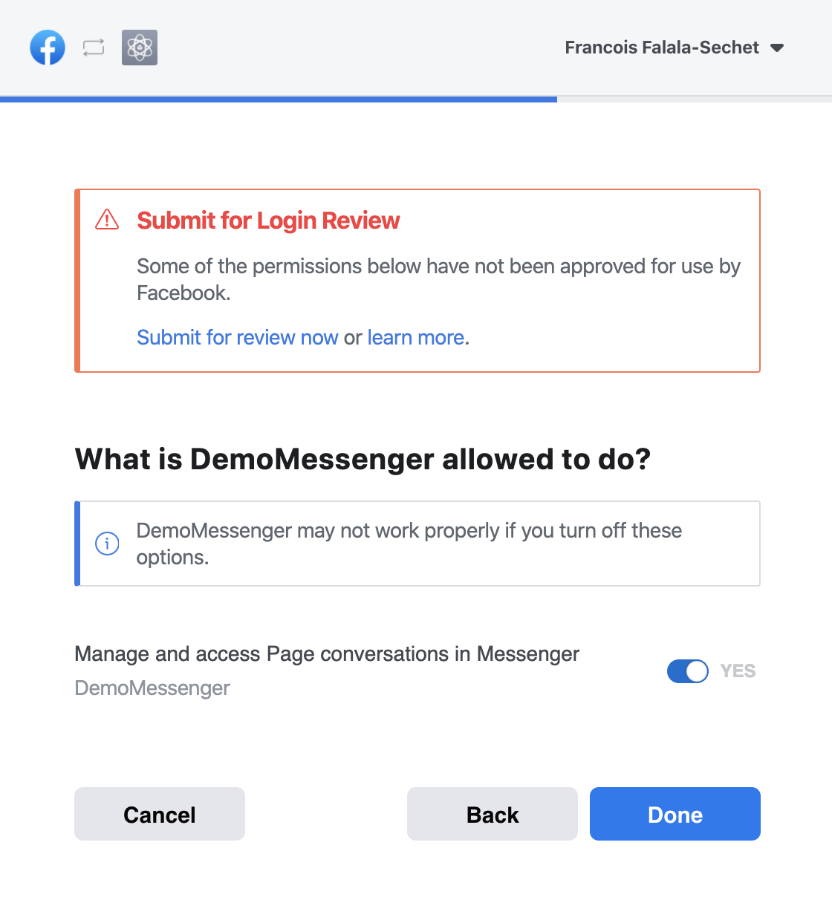
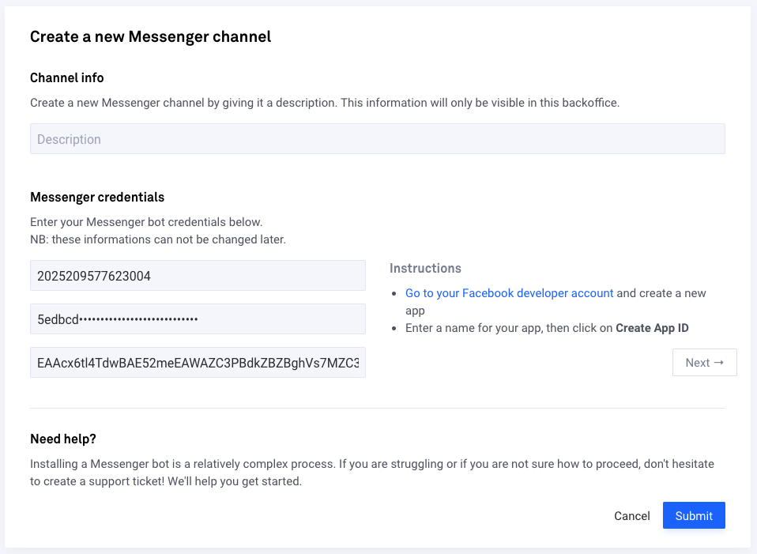
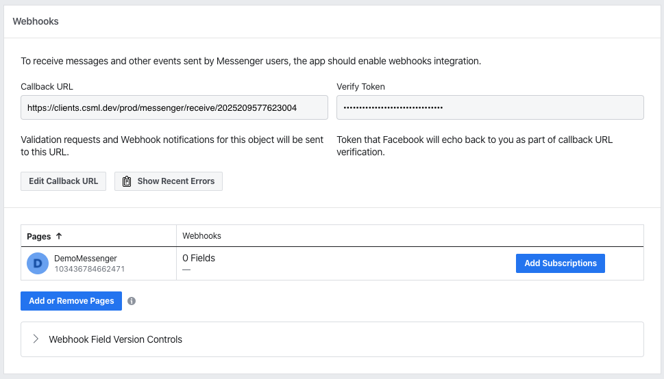
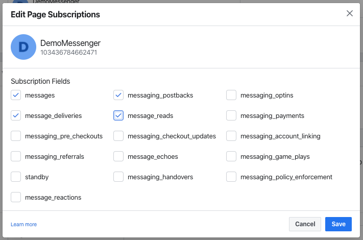
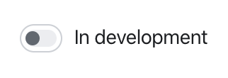

# Installation

There are several prerequisites to building a Messenger chatbot, which we will assume are already taken care of. Before we start, please make sure that you already have:

* an active Facebook account
* a Facebook page for your chatbot to be associated with
* a CSML chatbot ready to go

Please also make sure that your Facebook account is setup as a [developer account](https://developers.facebook.com). Once this is done, visit **Channels &gt; Connect new channel &gt; Messenger** on CSML Studio.

The installation process takes about 5 minutes and is relatively easy, although there are many steps involved. Follow along the instructions and everything will be fine!

## 1. Create a Facebook App

Visit your Facebook developer account and [create a new app](https://developers.facebook.com/apps).

Then, go to **Settings** &gt; **Basic** and take note of both **App ID** and **App Secret** for later. You can leave all other fields as is for now; it will be useful later for your app review by Facebook.

## 2. Connect the app to your page

In the left sidebar, click on the **+** next to **Products** then select **Messenger** in the list of available products.

In the next page, under **Access Tokens**, click on **Add or Remove Pages** and follow the steps. Creating a Facebook Page is not covered by this tutorial, but if you would like to create one now, you can also select **Create New Page**.

Once this is done, you will be able to see your page in the list of pages linked to your app. Click on **Generate Token**, check the box next to **I Understand**, then take note of the generated **Access Token**.

## 3. Connect your app to CSML Studio

In CSML Studio, go to **Channels** &gt; **Connect a new channel** &gt; **Messenger**. Add a name and description for your channel, then add the **App ID**, **App Secret** and **Access Token** you generated earlier in the corresponding inputs, then click on **Submit**.

## 4. Configuring the app's webhook to send and receive messages

In the Facebook Developers website, go to **Messenger** &gt; **Settings** &gt; **Webhooks**. Do not modify the Callback URL and Verify Token settings. Under Pages, find your page, click on **Add Subscriptions**.

In the next screen, select **messages**, **messaging\_postbacks**, **message\_deliveries**, **message\_reads**, then click **Save**.

Voilà! You can now search for your chatbot in Facebook Messenger \(it will be listed under the page's name\).

### Caveats


**Your App is in Development Mode**

Until your app has been submitted and approved for public use on Messenger, page tokens only allow your bot to interact with Facebook accounts that have been granted the Administrator, Developer, or Tester role for your app.


To grant these roles to other Facebook accounts \(people who you would like to give access to your bot\), go to the 'Roles' tab of your app settings.

## 5. Publishing your app

When you are satisfied with your bot, you need to set the app to Live mode so that it can receive messages from and to any facebook user, not just your testers. Before that, you need to have Facebook review your bot. This is beyond the scope of this tutorial, and there are plenty of resources online about this process. You can start by reading the [Facebook documentation](https://developers.facebook.com/docs/apps/review/) on the review process!


**You can not send and receive messages from/to the general public before it passes the review process**


When you have successfully passed Facebook's review process, don't forget to set your app to **Live** mode \(toggle switch **In development** at the top of your app's settings pages\).

