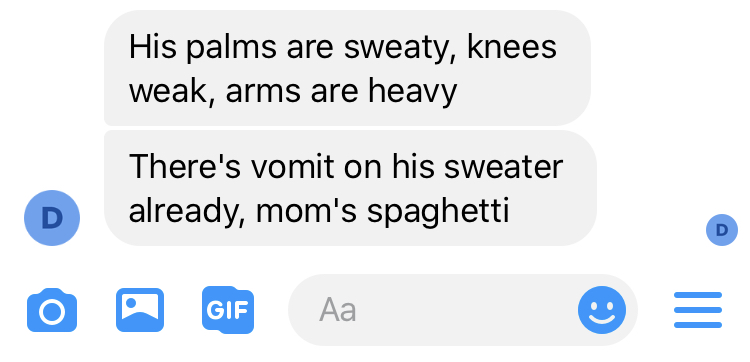
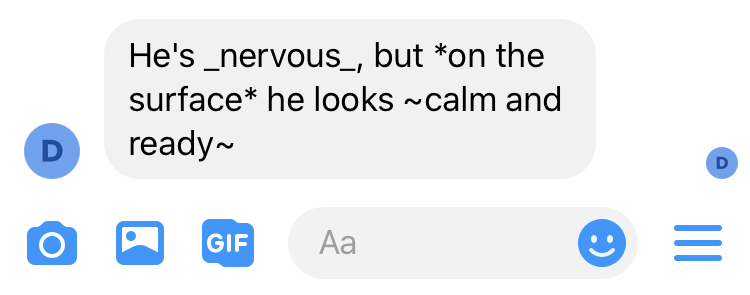
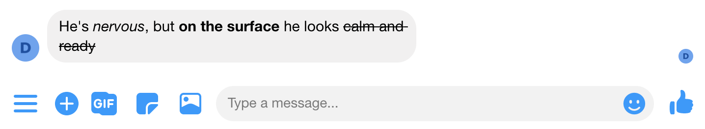
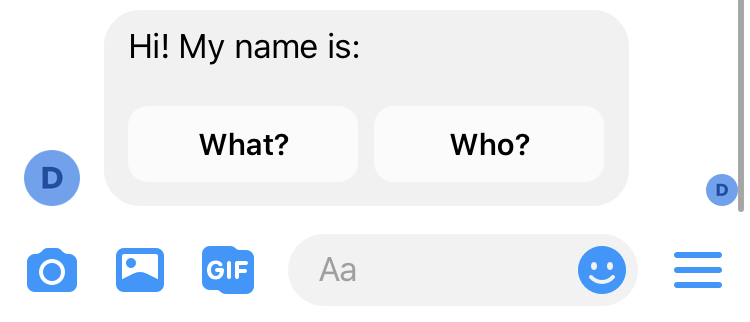
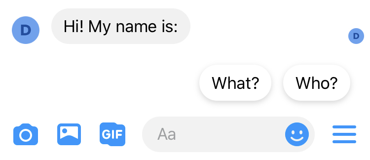
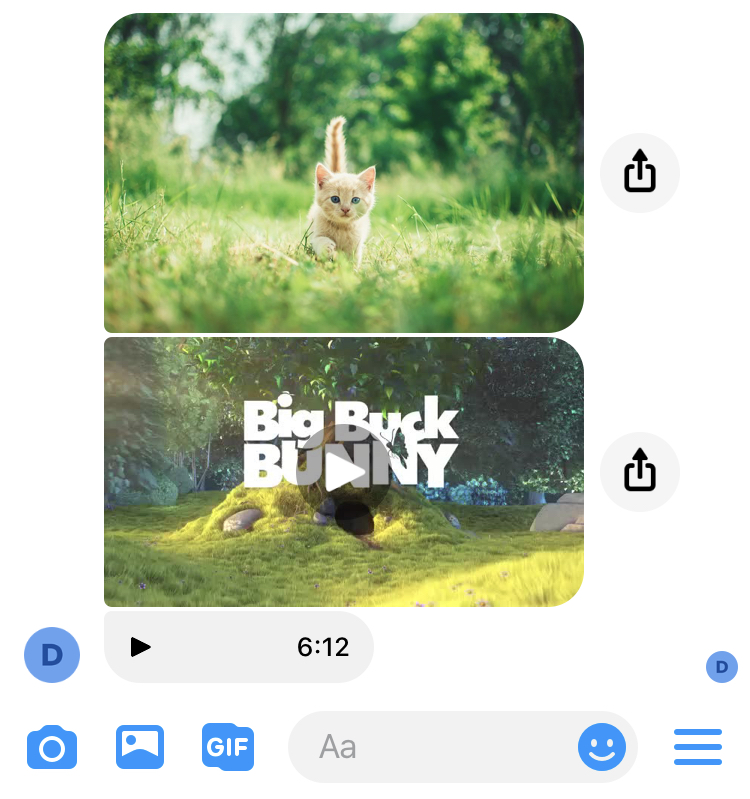
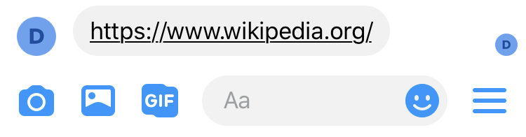
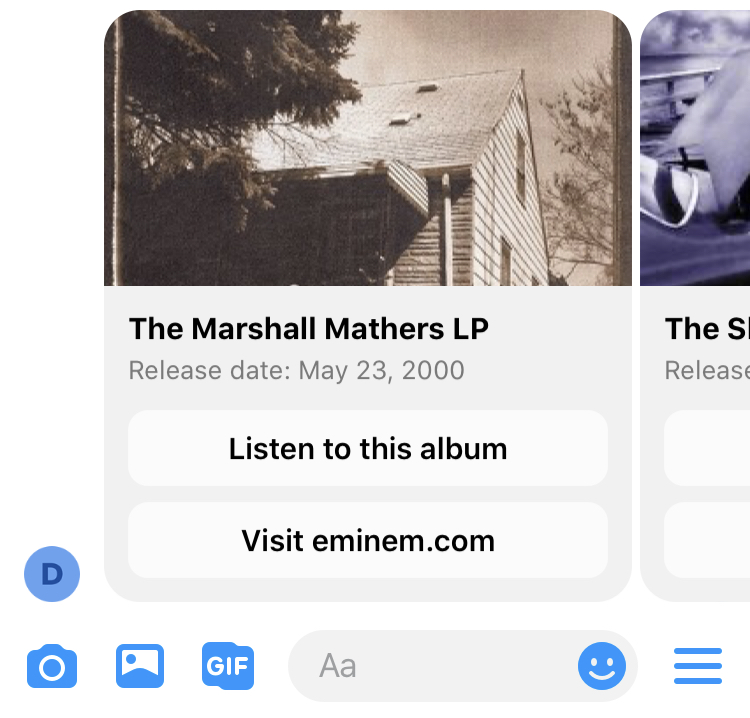
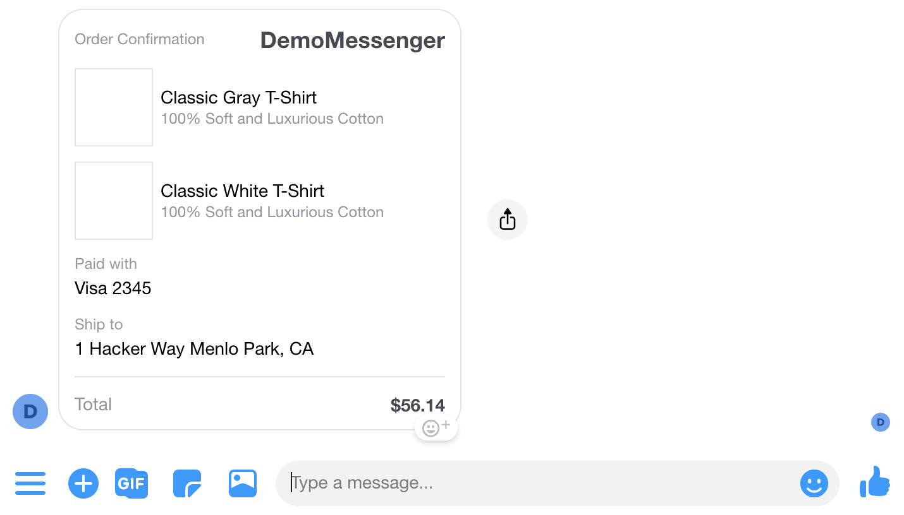

# Message formats

## Text

```cpp
say "His palms are sweaty, knees weak, arms are heavy" // short form
say Text("There's vomit on his sweater already, mom's spaghetti") // long form
```



Markdown support is scarce for Messenger, and various clients may render it differently. [As mentioned in the documentation](https://www.facebook.com/help/147348452522644), text formatting is only visible on a computer, and will not appear in the Messenger app on mobile.

```cpp
say "He's _nervous_, but **on the surface** he looks [calm and ready](https://www.youtube.com/watch?v=_Yhyp-_hX2s)"
```





## Typing, Wait

```cpp
say Typing(1000)
```


Obviously, `Wait` is also supported \(it simply does not display a typing indicator or anything for the given duration\).

## Question, Button

```cpp
say Question(
  "Hi! My name is:", // equivalent to title="Hi! My name is:",
  buttons=[Button("What?"), Button("Who?")]
)
```



You can also take advantage of Facebook's "[quick\_reply](https://developers.facebook.com/docs/messenger-platform/send-messages/quick-replies)" buttons. Here they are shown with a given payload \(which would also work on the above example\). There are 2 main differences between regular buttons and quick\_replies:

* you can have a maximum of 3 buttons, but up to 13 quick\_reply buttons
* quick\_reply buttons go away once the user clicks on one or says something, regular buttons stay forever

```cpp
say Question(
  "Hi! My name is:",
  button_type="quick_reply",
  buttons=[
		Button("What?", payload="btn1"),
		Button("Who?", payload="btn2"),
  ]
)
```




Messenger does not support a rendering a single`Button` component by itself. You must use buttons as part of `Question` or `Card` components.


## Video, Audio, Image, File

The media components behave exactly as the Attachment Upload API does in Messenger, with the same limitations.

If for some reason, we are unable to send a file, it will fallback to a simple `Url` component. For this reason, third-party media players will be rendered as simple links to those players, while raw media can show as a regular file/audio/video/image in the conversation.

The main limitations to know about are:

* file must be publicly accessible \(not behind firewall, not requiring any authentication\)
* file must be &lt; 25MB in size
* file must be able to upload to messenger in a reasonable amount of time

```cpp
say Image("https://images.unsplash.com/photo-1560114928-40f1f1eb26a0")
say Video("https://cdn.csml.dev/customers/93bfb0df-fb6b-4ed2-87b0-8d93a09b0ad8/files/cbaa0959-fe58-4a2a-89c3-c414a1f38748/big_buck_bunny.mp4")
say Audio("https://open.spotify.com/track/1xB3YT8Rakvnfcc1dp2kzJ")
```



## Url

Send the given URL in a simple text component.

```cpp
say Url("https://www.wikipedia.org/")
```



If a text parameter is present, it will be ignored, as Messenger is unable to display hyperlinks. The raw URL will always be used.


To display a nice URL, wrap it as a button to a `Question` or `Card` component.


## Carousel, Card

A `Carousel` is essentially a collection of `Card` elements A single `Card` will display as a `Carousel` of 1 element.

```cpp
do card1 = Card(
	"The Marshall Mathers LP",
	subtitle="Release date: May 23, 2000",
	image_url="https://upload.wikimedia.org/wikipedia/en/a/ae/The_Marshall_Mathers_LP.jpg",
  default_action=Url("https://www.eminem.com/"),
	buttons=[
		Button("Listen to this album", payload="marshallmatherslp1"),
		Url("https://www.eminem.com/", text="Visit eminem.com"),
	]
)
do card2 = Card(
	"The Slim Shady LP",
	subtitle="Release date: February 23, 1999",
	image_url="https://upload.wikimedia.org/wikipedia/en/3/35/Eminem_-_The_Slim_Shady_LP_CD_cover.jpg",
  default_action=Url("https://www.eminem.com/"),
	buttons=[
		Button("Listen to this album", payload="theslimshadylp"),
		Url("https://www.eminem.com/", text="Visit eminem.com"),
	]
)
do card3 = Card(
	"The Marshall Mathers LP 2",
	subtitle="Release date: November 5, 2013",
	image_url="https://upload.wikimedia.org/wikipedia/en/8/87/The_Marshall_Mathers_LP_2.png",
  default_action=Url("https://www.eminem.com/"),
	buttons=[
		Button("Listen to this album", payload="marshallmatherslp2"),
    Url("https://www.eminem.com/", text="Visit eminem.com"),
	]
)

say Carousel(cards=[card1, card2, card3])
```



The `Card` component on Messenger supports up to 3 `Button` or `Url` buttons. You can also define an optional `default_action` with a `Url` component on each card to make the card itself clickable.

## Raw object

You can send any valid message as per Messenger's Send API as a raw object. For instance, taking [this example from the documentation](https://developers.facebook.com/docs/messenger-platform/reference/templates/receipt#example_request) without any modification:

```cpp
say {
  "attachment":{
    "type":"template",
    "payload":{
      "template_type":"receipt",
      "recipient_name":"Stephane Crozatier",
      "order_number":"12345678902",
      "currency":"USD",
      "payment_method":"Visa 2345",        
      "order_url":"http://petersapparel.parseapp.com/order?order_id=123456",
      "timestamp":"1428444852",         
      "address":{
        "street_1":"1 Hacker Way",
        "street_2":"",
        "city":"Menlo Park",
        "postal_code":"94025",
        "state":"CA",
        "country":"US"
      },
      "summary":{
        "subtotal":75.00,
        "shipping_cost":4.95,
        "total_tax":6.19,
        "total_cost":56.14
      },
      "adjustments":[
        {
          "name":"New Customer Discount",
          "amount":20
        },
        {
          "name":"$10 Off Coupon",
          "amount":10
        }
      ],
      "elements":[
        {
          "title":"Classic White T-Shirt",
          "subtitle":"100% Soft and Luxurious Cotton",
          "quantity":2,
          "price":50,
          "currency":"USD",
          "image_url":"http://petersapparel.parseapp.com/img/whiteshirt.png"
        },
        {
          "title":"Classic Gray T-Shirt",
          "subtitle":"100% Soft and Luxurious Cotton",
          "quantity":1,
          "price":25,
          "currency":"USD",
          "image_url":"http://petersapparel.parseapp.com/img/grayshirt.png"
        }
      ]
    }
  }
}
```



## Full reference

For a complete reference of all the code presented on this page, refer to the [following gist](https://gist.github.com/frsechet/ad0f371cef0f27ae26efd28de87a8436):



