# Installation

The installation process of a Microsoft Teams chatbot has many steps. You will also need to be able to create an app and bot on your Microsoft Teams and Azure tenants. Once

To get started, visit **Channels &gt; Connect new channel &gt; Microsoft Bot Framework**.

## 1. Create a bot on Microsoft Bot Framework

Retrieve your Messaging endpoint from the Studio configuration page:

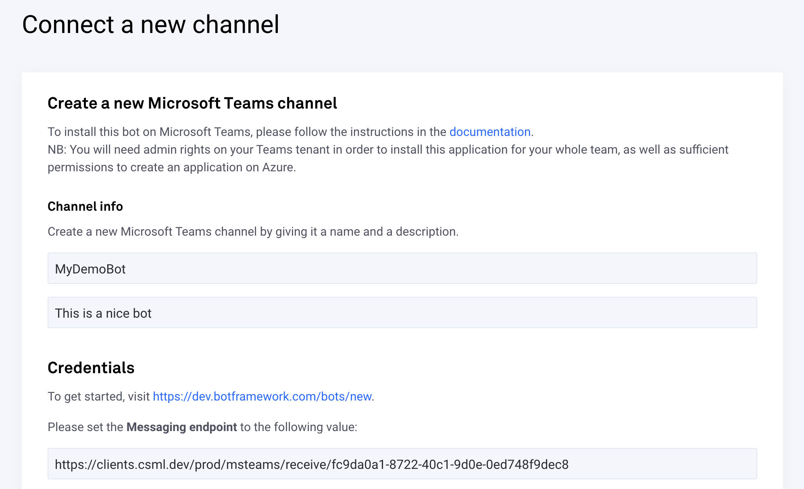

Visit [https://dev.botframework.com/bots/new](https://dev.botframework.com/bots/new) to create a new bot on Bot Framework. You may be asked to login to your developer account. On the next page, fill in a **name**, **description** and **bot handle** for your bot, as well as the **Messaging endpoint** from the previous step. Leav **Enable Streaming Endpoint** unchecked. Take note of the bot handle for later.

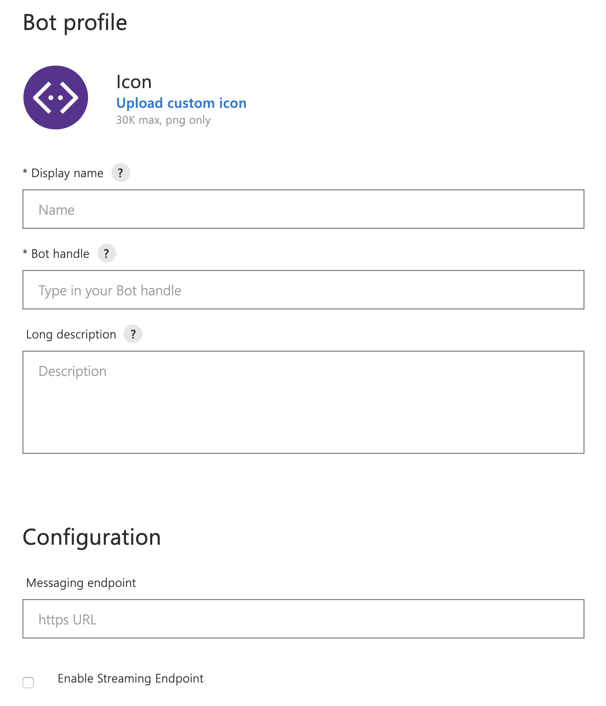

Next, select **Create Microsoft App ID and password**.

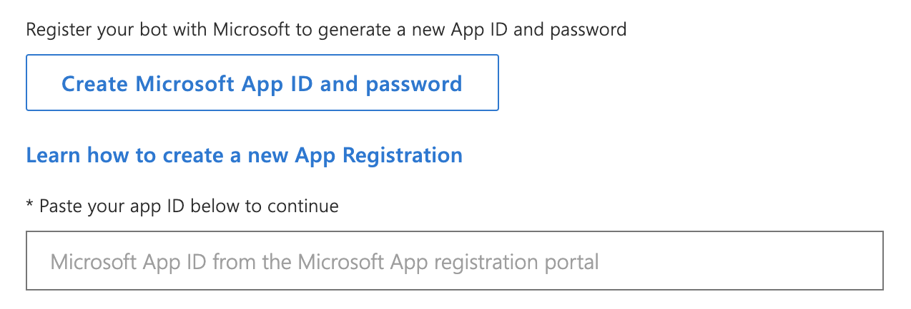

You will be taken to a new page on Azure to register a new app \(or list existing apps\). Click on **New registration**.

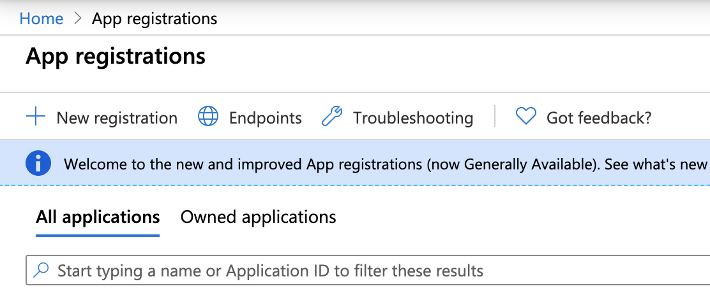

On the next page, fill in a **Name**, select the **Accounts in any organizational directory - Multitenant** option \(the reason is that you will be using the Microsoft Bot Framework tenant for your bot, which will require access to the app as well\) and check **Background process and Automation** under Platform configuration, then click Register.

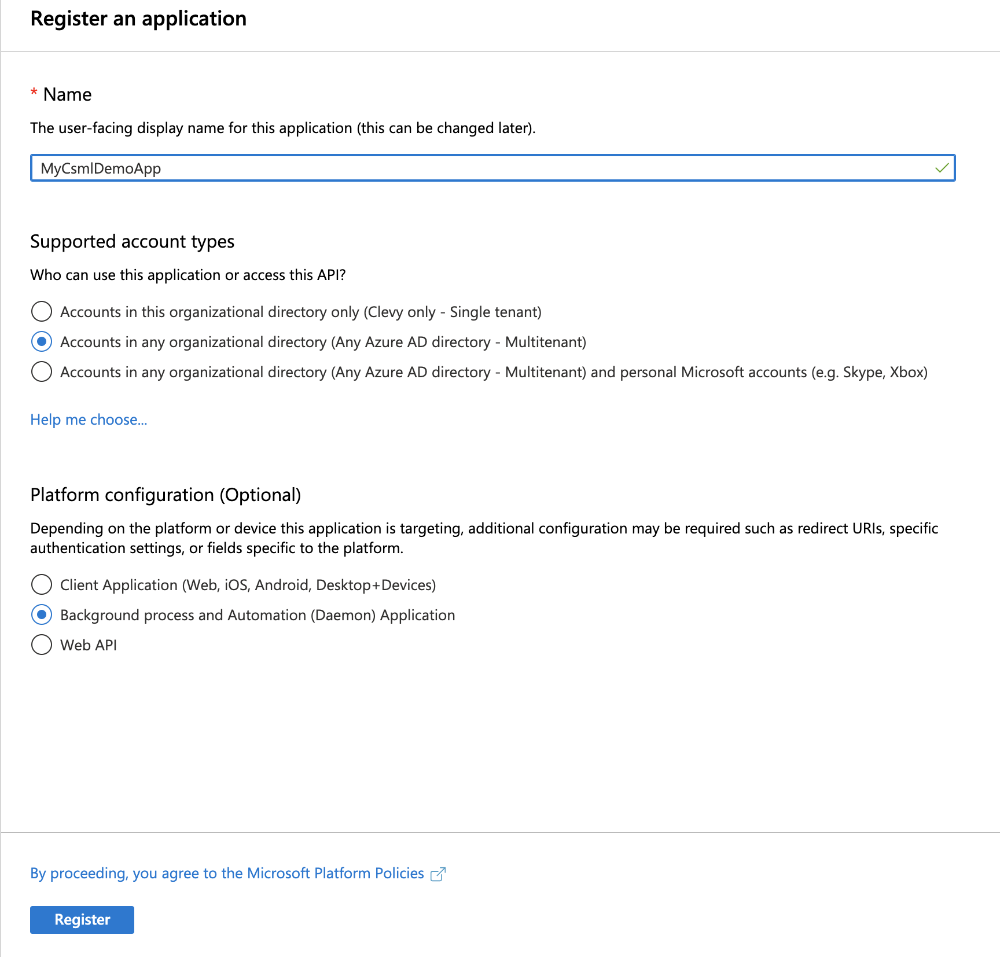

On the next page, create a **New client secret**, give it a **name** and a validity date \(if you select anything other than Never, you will need to come back occasionally and get a new secret\), submit, then take note of the given secret \(you will never be able to see it again\).

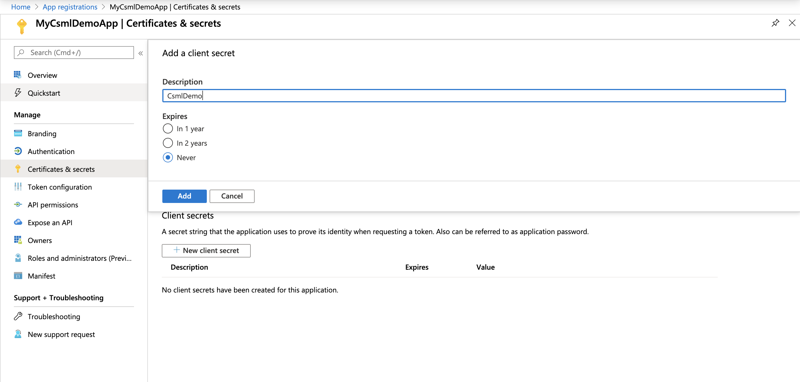

Now, go to Overview and take note of the App ID for later. After that, you can close this window.

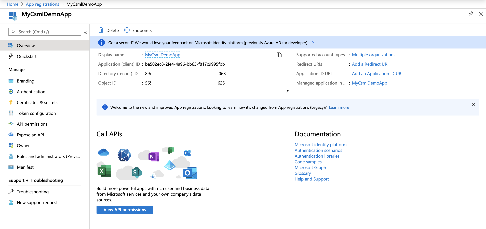

Back to the Bot Framework configuration window, paste the Microsoft App ID you just created where required, then scroll to the bottom of the page, check the "I Agree" box and click **Register**.

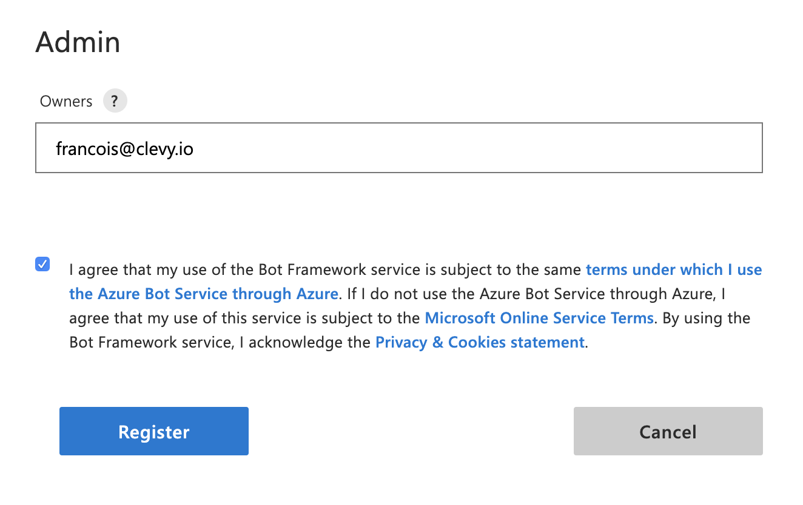

## 2. Registering Microsoft Teams as a channel on Bot Framework

After registering your bot, you need to add Microsoft Teams as a channel. To do so, simply click on the **Configure Microsoft Teams channel** icon.

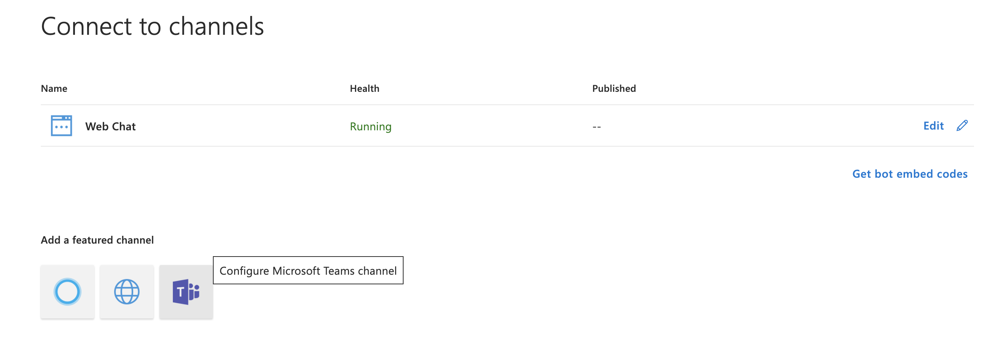

On the next page, simply click **Save** without doing anything else, check the "I Agree" box, and submit.

You can now close this window as well and go back to the CSML Studio.

## 3. Connect the bot to CSML Studio

Back to the CSML Studio channel creation page, fill in the **App ID**, **App secret** and **Bot handle**, then submit.

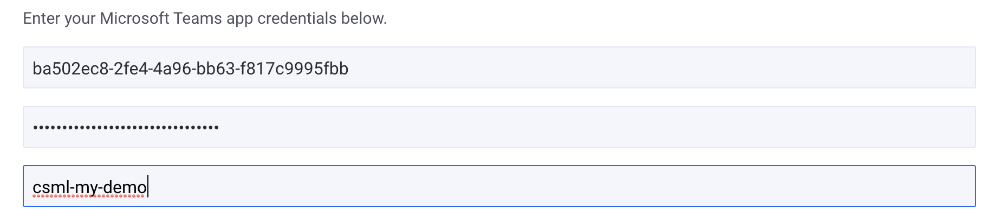

In the next page, you can generate and download a **Manifest** for your Microsoft Teams chatbot. A manifest is a configuration file that you will be able to upload on Microsoft Teams in order to deploy your chatbot to your team. It contains all the information required for Microsoft to correctly install and display your bot to every user.


Experts only: you can also use Microsoft Team's App Studio to generate a valid manifest.


Upon saving, a **manifest.zip** file will be downloaded to your computer. Save it somewhere for the next \(and final\) installation step.

## 4. Deploy your bot on Microsoft Teams

On Microsoft Teams \(web or desktop\), find the **Apps** panel, then select **Upload custom app &gt; Upload for MY\_TEAM** \(obviously, replace MY\_TEAM with the name of your own team\).

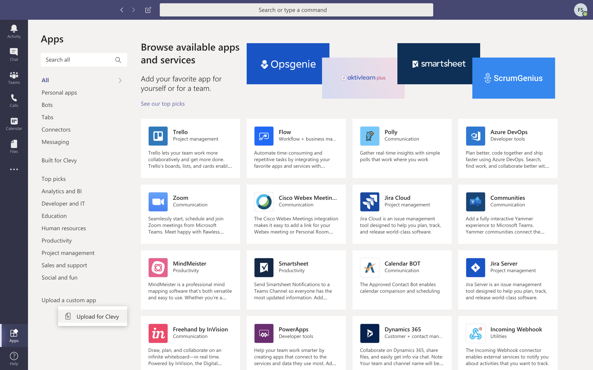

Then, click on the App you just uploaded, then select Add.

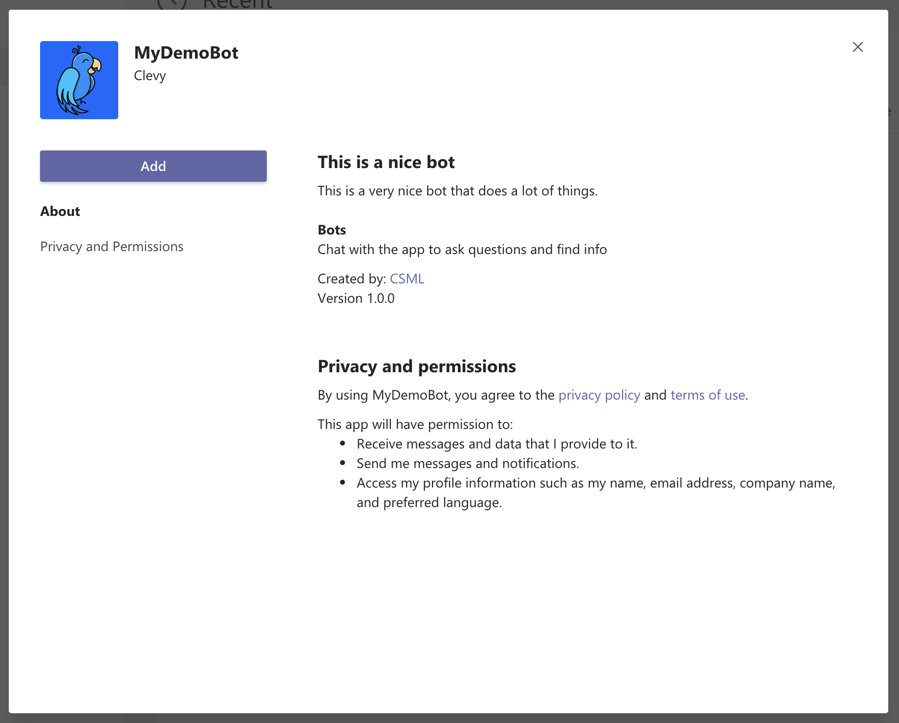

Voilà! Your bot is now available to all users in your team:

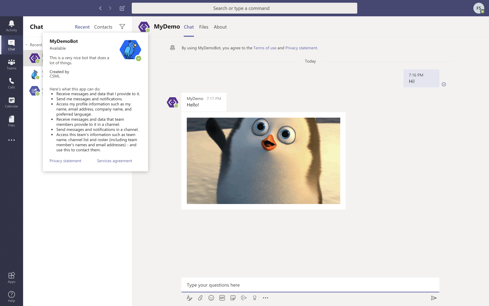

