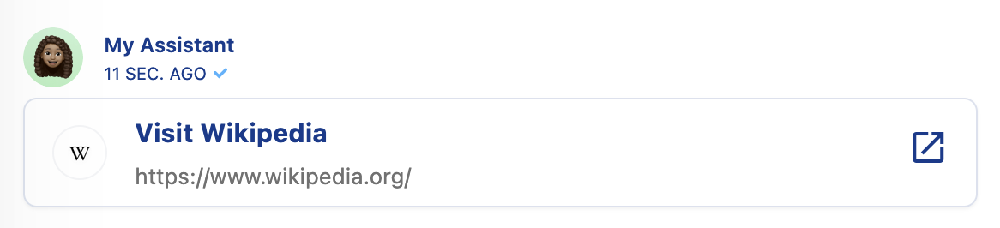

# Installation

To get started, visit your [Slack apps](https://api.slack.com/apps) and click on **Create New App**. Enter a name for your app, select your Workspace in the dropdown \(admin rights required\), then click on **Create App**.

Go to **Event Subscriptions** in the left-side menu. Switch on the **Enable Events** toggle, then enter [**https://clients.csml.dev/v1/slack/receive**](https://clients.csml.dev/v1/slack/receive) in the **Request URL** field.

On the same page, click on **Add Bot User Event** under **Subscribe to Bot Events**, then click on **Save Changes**.

Select **Interactivity and Shortcuts** in the left-side menu. Switch it on and enter [**https://clients.csml.dev/prod/slack/receive**](https://clients.csml.dev/prod/slack/receive) in the **Request URL** field, then click on **Save Changes.**

Select **OAuth and Permissions** in the left-side menu**.** Verify that the following minimum **Bot Token Scopes** are selected: `app_mentions:read`, `im:history`, `im:read`, `im:write`, `chat:write`, `links:read`, `links:write`, `files:read` ,`files:write`and `users.profile:read`.

At the top of the page, click on **Install App to Workspace**. You will be redirected to confirm your identity; you need to **Authorize** the app.

After a few seconds, you will be redirected to the previous page, where you need to copy the **Bot User Token** and save it for later.

Next, select **App Home** in the left-side menu. Enter a Display Name and a Default Name for your bot and select **Always Show My Bot as Online**.

Select **Basic Information** in the left-side menu.Under **App Credentials**, copy **App ID**, **Client ID**, **Client Secret** and **Signing Secret**, and save them for later.

On the same page, you can also customize the appearance of your chatbot in Slack \(image, colors...\).

Back in CSML Studio, under Channels &gt; Create new channel &gt; Slack, paste the credentials you retrieved earlier: Bot user token, App ID, Client ID, Client Secret, Signing Secret, then click on **Submit**.

In your Slack Workspace, click on **Browse Apps**, add the app you just created, then start a conversation with the bot!

