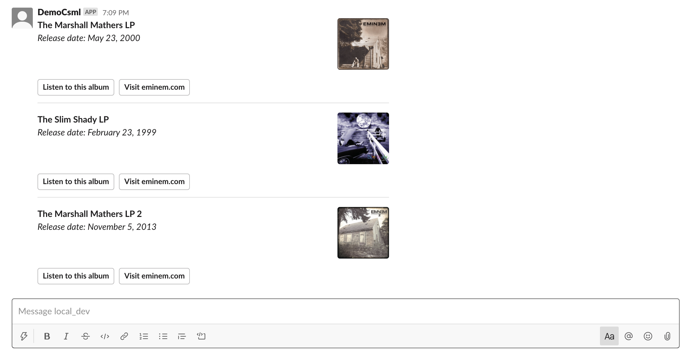

# Message formats

## Text

Slack has partial markdown support in text components.

```cpp
say "His palms are sweaty, knees weak, arms are heavy"
say Text("There's vomit on his sweater already, mom's spaghetti")
say "He's _nervous_, but **on the surface** he looks ~calm and ready~"
```

.png>)

## Typing, Wait

In Slack, `Wait` and `Typing` have the same behavior. No typing indicator exists in slack, so the bot will simply wait for the duration given (in milliseconds) before the next message is processed.

```cpp
say Typing(1000)
say Wait(1000)
```

## Question, Button

Slack makes it possible to style your buttons and define a custom payload that is sent to the chatbot on click. Available styles are "danger" and "primary". Slacks recommends to only use primary on one button in a list, and danger even less often.

```cpp
say Question(
  "Hi! My name is:",
  buttons=[
    Button("What?", payload="btn1"),
    Button("Who?", payload="btn2", style="danger"),
    Button("Slim Shady", payload="btn3", style="primary"),
  ]
)
hold
say "User selected: {{event}}"
```

.png>)

CSML Studio will also take advantage of Slack's features to update the content of the component when an option is chosen, so that the user's choice appears clearly after they select an option.

.png>)

## Image

Send the URL of an image. Slack will attempt to display it.

```cpp
say Image(
  "http://placekitten.com/500/500",
  title="Nice kitten", // optional
  alt="this is a photo of a cute kitten", // optional
)
```

.png>)

## Video, Audio, Url

Generic files will render as standard URLs. When it can, Slack will try to display the URL nicely, such as the Wikipedia link below.

```cpp
say Video("https://cdn.csml.dev/customers/93bfb0df-fb6b-4ed2-87b0-8d93a09b0ad8/files/cbaa0959-fe58-4a2a-89c3-c414a1f38748/big_buck_bunny.mp4")
say Audio("https://www.soundhelix.com/examples/mp3/SoundHelix-Song-1.mp3")
say Url("https://www.wikipedia.org/")
```


## Carousel, Card

A `Carousel` is essentially a collection of `Card` elements A single `Card` will display as a `Carousel` of 1 element.

```cpp
do card1 = Card(
  "The Marshall Mathers LP",
  subtitle="Release date: May 23, 2000",
  image_url="https://upload.wikimedia.org/wikipedia/en/a/ae/The_Marshall_Mathers_LP.jpg",
  buttons=[
    Button("Listen to this album", payload="marshallmatherslp1"),
    Url("https://www.eminem.com/", text="Visit eminem.com"),
  ]
)
do card2 = Card(
  "The Slim Shady LP",
  subtitle="Release date: February 23, 1999",
  image_url="https://upload.wikimedia.org/wikipedia/en/3/35/Eminem_-_The_Slim_Shady_LP_CD_cover.jpg",
  buttons=[
    Button("Listen to this album", payload="theslimshadylp"),
    Url("https://www.eminem.com/", text="Visit eminem.com"),
  ]
)
do card3 = Card(
  "The Marshall Mathers LP 2",
  subtitle="Release date: November 5, 2013",
  image_url="https://upload.wikimedia.org/wikipedia/en/8/87/The_Marshall_Mathers_LP_2.png",
  buttons=[
    Button("Listen to this album", payload="marshallmatherslp2"),
    Url("https://www.eminem.com/", text="Visit eminem.com"),
  ]
)

say Carousel(cards=[card1, card2, card3])
```



You can add several `Button` or `Url` buttons to your `Card` components.

## Input, Textarea

```cpp
// the same works with Textarea()
say Input(
  title="Enter something below",
  description="This is a simple text field, and you can say whatever you want",
  placeholder="Whatever you want",
  submit_label="Submit",
)
```

.png>)

## Radio, Dropdown

```cpp
// the same works with Dropdown()
say Radio(
  // Mandatory
  options = [
    Button("Cats 🐕", payload="meow"),
    Button("Dogs 🐶", payload="woof"),
    Button("Hot dogs 🌭", payload="yummy"),
  ],

  // Optional fields:
  title="What's your favorite animal?",
  description="You can only pick one!",
)
```

.png>)

## Multiselect, Checkbox

```cpp
// the same works with Multiselect()
say Checkbox(
  // Mandatory
  options = [
    Button("Cats 🐕", payload="meow"),
    Button("Dogs 🐶", payload="woof"),
    Button("Hot dogs 🌭", payload="yummy"),
  ],

  // Optional fields:
  title="What's your favorite animal?",
  description="You can pick many!",
)
```

.png>)

## Calendar

```cpp
say Calendar(title="Select your date of birth", submit_label="OK")
```

.png>)

## Full reference

For a complete reference of all the code presented on this page, refer to the [following gist](https://gist.github.com/frsechet/f2c59db56c149dade53c77598229d188):



## Event Metadata

A sample `_metadata`  for an incoming event will be similar to the following object:

```javascript
{
  "_channel": {
    "app_id": "YYYYYYYYY",
    "type": "slack",
    "name": "Slack channel"
  },
  "last_name": "Doe",
  "user_id": "XXXXXXXX",
  "email": "john.doe@example.com",
  "first_name": "John"
}
```
