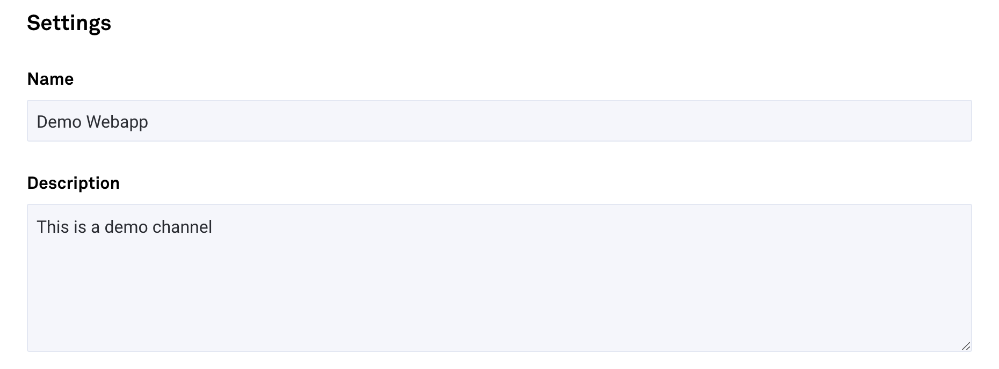
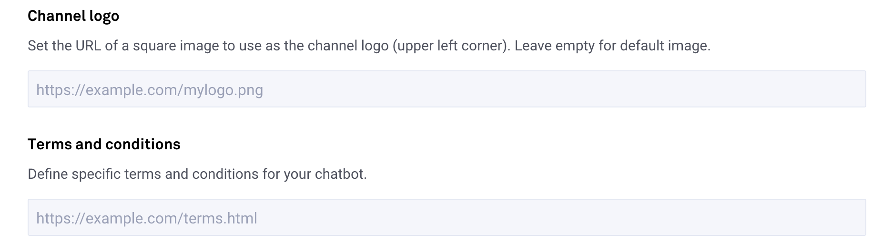
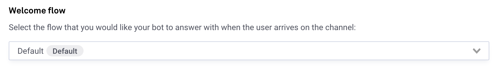
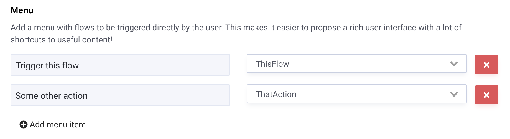
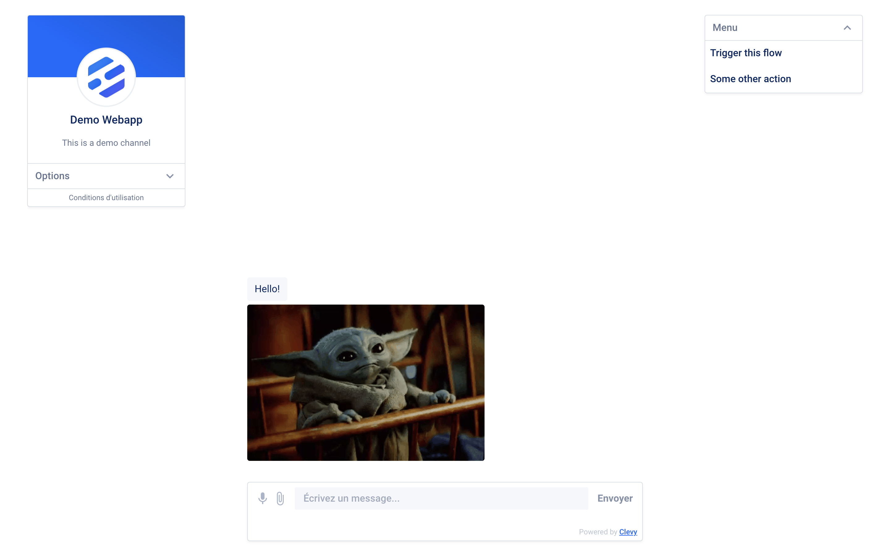
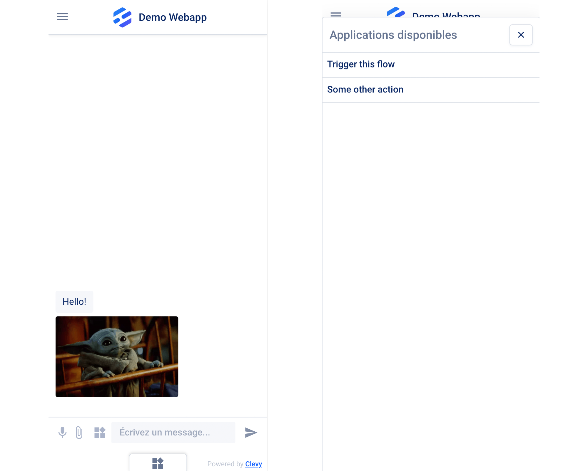

# Configuration

## General information

The settings panel has a few options to allow you to configure the webapp. Each webapp must have a name, and you can also add an optional description and logo. If needed, you can also link to your own terms and conditions as well.






## Welcome flow

When a user arrives on the page, the chatbot welcomes them with a flow. It can be any flow, but by default it is the Default flow.



If you do not want a welcome interaction at all, create an empty flow and use that as the Welcome flow!

## Application menu

If you want your users to be able to quickly launch any of your flows, you can use the menu, by adding shortcuts to any of the existing flows. For each flow, you must define a label to make it easily recognizable by your users.





In mobile view, the applications menu will show at the bottom of the screen and slide up when activated:



## Referral Parameter

You can launch a specific flow (and step) instead of the default Welcome Flow when loading the webapp by providing a `ref` parameter in the webapp URL.

There are two ways to use Ref parameters to redirect to flows. You can either configure them in the channel's settings page by adding connections between custom Ref parameters and a target flow:

.png>)

Or you can use the following special syntax:

```yaml
# will redirect to the step NAME_OF_STEP in the flow called NAME_OF_FLOW
https://m.me/12345678901234?ref=target:NAME_OF_STEP@NAME_OF_FLOW

# or, if no step is provided, the `start` step will be used
https://m.me/12345678901234?ref=target:NAME_OF_FLOW
```

The main advantage of the second syntax is that you can generate the links on the go; however, the first method is more flexible as you can easily change where a link is redirected even after it is created, and the content of the Ref parameter is entirely customizable.

