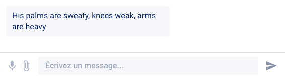
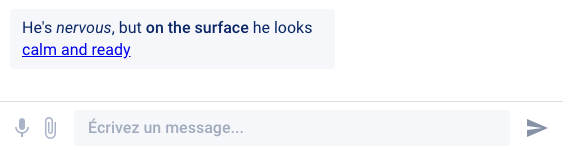
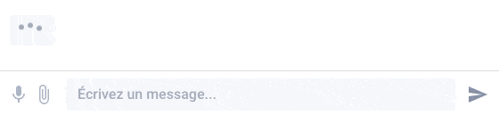
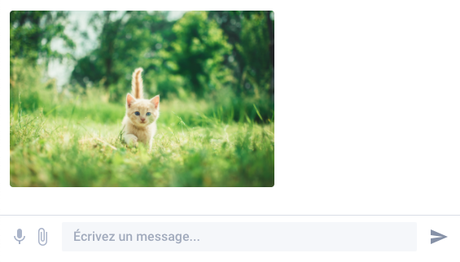
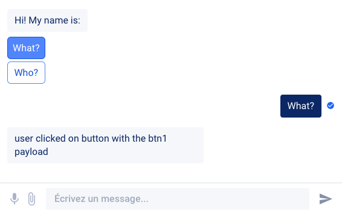
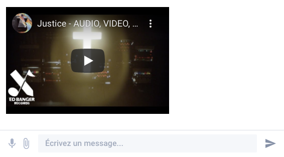
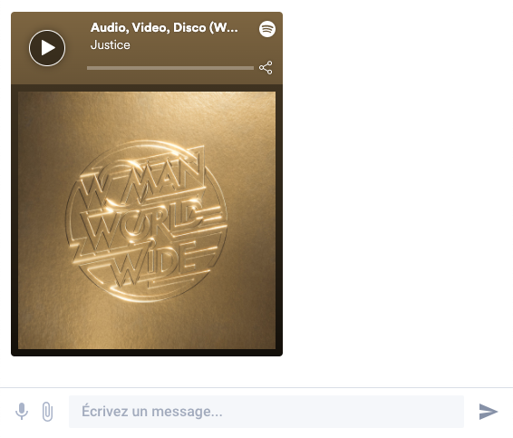
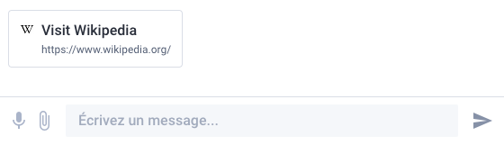

# Message Formats

## Text

```cpp
say "His palms are sweaty, knees weak, arms are heavy" // short form
say Text("There's vomit on his sweater already, mom's spaghetti") // long form
```



The `Text` component of the Webapp channel also supports some basic Markdown:

```cpp
say "He's _nervous_, but **on the surface** he looks [calm and ready](https://www.youtube.com/watch?v=_Yhyp-_hX2s)"
```



## Typing, Wait

```cpp
say Typing(1000)
```



Obviously, `Wait` is also supported (it simply does not display a typing indicator or anything for the given duration).

## Image

```cpp
say Image("https://images.unsplash.com/photo-1560114928-40f1f1eb26a0")
```



## Question, Button

```cpp
say Question(
  "Hi! My name is:", // equivalent to title="Hi! My name is:",
  buttons=[Button("What?"), Button("Who?")]
)
```


If you need to retrieve a specific data when clicking on either button, use the `payload` argument of the Button component:

```cpp
say Question(
  "Hi! My name is:",
  buttons=[
        Button("What?", payload="btn1"),
        Button("Who?", payload="btn2"),
  ]
)
hold
say "user clicked on button with the {{event}} payload"
```




The Webapp channel also supports single `Button` components. However, as cross-channel support for single buttons is not guaranteed, we encourage you to use the standard Question component instead, with a title.


## QuickReply

Quick replies are similar to Questions, where the buttons are removed from view once the user has selected one of them. In a majority of scenarios, you should prefer QuickReplies over regular questions, especially when you don't want the user to be able to scroll up and select one of the buttons after they have made a first choice. Questions should be used when a button is used as a trigger to a given flow (as configured in the bot's [AI Rules](../../getting-started/nlp/ai-rules.md)).

```cpp
say QuickReply(
  "Do you like cheese?",
  buttons=[Button("Yes 🧀"), Button("Also yes 🫕")]
)
```

.png>)


Try this bot: [https://play.csml.dev/bot/0e85f280-d502-4535-8b78-fb763979777e](https://play.csml.dev/bot/0e85f280-d502-4535-8b78-fb763979777e)


## UserInput

In some cases it may be desirable to temporarily disable the user input to force the user to select one of the options without letting them type anything.

```cpp
say UserInput(false) // disables the user input
say UserInput(true) // reenables the user input
```

Please note that if the page is refreshed, the user input will go back to being enabled by default even if it was first disabled.


Try this bot: [https://play.csml.dev/bot/7eadb879-c0d9-407e-af88-c0dcf76f11b4](https://play.csml.dev/bot/7eadb879-c0d9-407e-af88-c0dcf76f11b4)


## Video, Audio

The Video component supports links to mp4 files, as well as Youtube, Vimeo and Dailymotion URLs. The Audio component supports links to mp3 files, as well as Spotify, Soundcloud and Deezer URLs.

```cpp
say Video("https://www.youtube.com/watch?v=lqBhgEQ4LT0")
```



```cpp
say Audio("https://open.spotify.com/track/1xB3YT8Rakvnfcc1dp2kzJ")
```




**Standard limitations apply**: if the end user is not logged in to a valid spotify/deezer/soundcloud account, only 30s will be playable in the audio component.

For full control over the clip, prefer using a standard mp3 file URL.


## Url

The `Url` component will automatically retrieve the target's favicon if available. If a `text` parameter is present, it will be used as the component's title.

```cpp
say Url("https://www.wikipedia.org/", text="Visit Wikipedia")
```



## Carousel, Card

A `Carousel` is essentially a collection of `Card` elements A single `Card` will display as a `Carousel` of 1 element. Each `Card` can have a maximum of 2 `Button` elements.

```cpp
do card1 = Card(
    "The Marshall Mathers LP",
    subtitle="Release date: May 23, 2000",
    image_url="https://upload.wikimedia.org/wikipedia/en/a/ae/The_Marshall_Mathers_LP.jpg",
    buttons=[Button("Listen to this album", payload="marshallmatherslp1")]
)
do card2 = Card(
    "The Slim Shady LP",
    subtitle="Release date: February 23, 1999",
    image_url="https://upload.wikimedia.org/wikipedia/en/3/35/Eminem_-_The_Slim_Shady_LP_CD_cover.jpg",
    buttons=[Button("Listen to this album", payload="theslimshadylp")]
)
do card3 = Card(
    "The Marshall Mathers LP 2",
    subtitle="Release date: November 5, 2013",
    image_url="https://upload.wikimedia.org/wikipedia/en/8/87/The_Marshall_Mathers_LP_2.png",
    buttons=[Button("Listen to this album", payload="marshallmatherslp2")]
)

say Carousel(cards=[card1, card2, card3])
```

.png>)

The cards themselves can be made clickable by adding an optional `default_action` Url() parameter:

```cpp
do card = Card(
    "The Marshall Mathers LP",
    subtitle="Release date: May 23, 2000",
    default_action=Url("https://en.wikipedia.org/wiki/Eminem"),
    image_url="https://upload.wikimedia.org/wikipedia/en/a/ae/The_Marshall_Mathers_LP.jpg",
    buttons=[Button("Listen to this album", payload="marshallmatherslp1")]
)
```

The carousel can also automatically navigate horizontaly by adding the optional `autoplay` parameter (which defaults to `false`):

```cpp
say Carousel([ card1, card2, card3 ], autoplay=true)
```

## Calendar

This component will display a rich calendar in the webapp. By default, when passed with no argument, a simple single-date datepicker will appear:

```cpp
say Calendar()
```

.png>)

Optional parameters allow to set a `min_date` and/or `max_date` (by unix timestamp, in milliseconds) or an `input_mode` to accept `single` (the default) `multiple` or `range` inputs by the user:

```cpp
say Calendar(
    min_date=1617494400000, // April 4th, 2021
    max_date=1623974400000, // June 18th, 2021
    input_mode="range" // can also be "multiple" or "single"
)
```

.png>)

.png>)

The `event` value of a Calendar input will be comma-separated values of all user inputs. Also, `event.input_mode` will be set to the mode of the requested calendar, so that you can differenciate between `single`, `multiple` and `range` modes when receiving values.

```cpp
// given this sample CSML code
say Calendar(...)
hold
say "{{event.get_content()}}"

// example single mode
{
  "input_mode":"single",
  "payload":"2021-04-07T00:00:00.000+02:00"
}
// example multiple mode
{
  "input_mode":"multiple",
  "payload":"2021-04-07T00:00:00.000+02:00,2021-04-15T00:00:00.000+02:00,2021-04-20T00:00:00.000+02:00"
}
// example range mode
{
  "input_mode":"range",
  "payload":"2021-04-07T00:00:00.000+02:00,2021-04-15T00:00:00.000+02:00"
}
```


Try this bot: [https://play.csml.dev/bot/8ec99c8c-5bfb-44cd-974d-b7781009279b](https://play.csml.dev/bot/8ec99c8c-5bfb-44cd-974d-b7781009279b)


## Input

To gain some control over what a user can enter in a form (for example, if you need to make sure they only enter an email address or a valid number when required), you can also use the `Input` component.

There are several variants of input fields: `email`, `text`, `textarea`, `number` and `password`. By default, inputs are `type="text"`. All parameters are optional, and the basic usage is as follows:

```cpp
say Input(
  type="text", // default
  title="What is this field?",
  description="Some details about what is expected",
  minlength=0, // for text/email/textarea inputs only
  maxlength=100, // for text/email/textarea inputs only
  required=false,
  placeholder="This is an input",
  default_value="This is set by default",
  submit_label="Submit" // the text for the validation button, defaults to OK
)
```

.png>)

You can check this reference about the minlength and maxlength parameters: [https://developer.mozilla.org/en-US/docs/Web/HTML/Element/input/text#additional\_attributes](https://developer.mozilla.org/en-US/docs/Web/HTML/Element/input/text#additional\_attributes)

A completely bare `say Input()` component will result in this simple, empty text input:

.png>)

Inputs with `type="number"` can have some different parameters, just like HTML inputs (all are optional as well):

```cpp
say Input(
  type="number",
  title="Enter a number",
  min=-14.3,
  max=42,
  // the other parameters from the previous example also apply
)
```

.png>)

You can check this reference about the min and max parameters: [https://developer.mozilla.org/en-US/docs/Web/HTML/Element/Input/number#additional\_attributes](https://developer.mozilla.org/en-US/docs/Web/HTML/Element/Input/number#additional\_attributes).


To learn more about the inputs with type="password", read the documentation about secure inputs (`hold_secure`): [https://docs.csml.dev/language/standard-library/keywords#hold\_secure](https://docs.csml.dev/language/standard-library/keywords#hold\_secure)


## Radio

Display a radio buttons component:

```cpp
say Radio(
  // Mandatory
  options = [
    Button("Cats 🐕", payload="meow"),
    Button("Dogs 🐶", payload="woof"),
    Button("Hot dogs 🌭", payload="yummy"),
  ],

  // Optional fields:
  title="What's your favorite animal?",
  description="You can only pick one!",
  selected = "yummy", // Preselect a value
)
```

 (1).png>)





## Multiselect, Checkbox

If you want to let users select multiple options, the `Multiselect()` or \`Checkbox()\` components are a great solution. Users will be able to select any number of options in the given list. You can force a `min` and `max` number of choices, or if `required=true`, it means that at least one option must be selected to continue.

Both the Multiselect and Checkbox components work exactly the same, only the display will be different. Try both to find out which one suits you best!

```cpp
// A list of options that are highlighted as you select them
say Multiselect(
  title="Why do you like CSML?",
  description="Select all options that apply!",
  min=2,
  submit_label="Yes, that's it!",
  options=[
    Button("It's easy to learn", payload="easy"),
    Button("It's pretty quick", payload="fast"),
    Button("It's scalable", payload="scalable"),
    Button("It's fun", payload="fun"),
    Button("The mascot 🦜 is cool", payload="pako"),
  ]
)

// The same component also works as a simple checkbox list
say Checkbox(
  title="Why do you like CSML?",
  description="Select all options that apply!",
  min=2,
  submit_label="Yes, that's it!",
  options=[
    Button("It's easy to learn", payload="easy"),
    Button("It's pretty quick", payload="fast"),
    Button("It's scalable", payload="scalable"),
    Button("It's fun", payload="fun"),
    Button("The mascot 🦜 is cool", payload="pako"),
  ]
)
```

.png>)

.png>)

When several options are selected, you will receive a comma-separated list of the corresponding payloads (_not necessarily the button's title!_), in the order they were selected by the user. In the case above, you would receive:

.png>)

## Dropdown

Like the Radio component, the Dropdown lets users pick an option from a list:

.png>)

```cpp
say Dropdown(
  // Mandatory list of options
  options=[
    Button("It's easy to learn", payload="easy"),
    Button("It's pretty quick", payload="fast"),
    Button("It's scalable", payload="scalable"),
    Button("It's fun", payload="fun"),
    Button("The mascot 🦜 is cool", payload="pako"),
  ],

  // Optional parameters
  title="Why do you like CSML?",
  description="Select the principal reason!",
  placeholder="They are all good reasons...",
  selected="easy", // value selected by default
  submit_label="Yes, that's it!",
)
```

## LaTeX

[LaTeX](https://en.wikipedia.org/wiki/LaTeX) is a popular language that lets you write (among other things) complex math formulas. The webapp and chatbox include [KaTeX](https://katex.org/) to support this language natively with a custom component:

```cpp
start:
  say LaTeX(
    "\(x^2 + y^2 = z^2\)",
    // If the user has "audio mode" enabled the tts parameter
    // will be used as the basis for the speech synthesis
    tts="This is the Pythagorean theorem!",
  )

  say LaTeX("\\def\\arraystretch{1.5}
   \\begin{array}{c:c:c}
   a & b & c \\\\ \\hline
   d & e & f \\\\
   \\hdashline
   g & h & i
\\end{array}")
```

.png>)

You can find more examples of supported formats on the KaTeX documentation: [https://katex.org/docs/supported.html](https://katex.org/docs/supported.html). Please keep in mind that backslashes (`\`) must be escaped properly in your code!

You can also add LaTeX inline in any standard text like by encapsulating it inside `{latex}...{/latex}` tags:

```cpp
say "This equation {latex} \(x^2 + y^2 = z^2\) {/latex} is super cool"
```


Try this bot: [https://play.csml.dev/bot/16a2034a-bf28-41b7-afb5-dc7d5aee0d25](https://play.csml.dev/bot/16a2034a-bf28-41b7-afb5-dc7d5aee0d25)


## Signature

You can display a simple signature field i.e to collect user consent and receive it as a png file.

```cpp
// Display a simple signature field
say Signature()

// The field can be customized (all parameters are optional)
say Signature(
  "Please sign here!",
  description="Yes please do!",
  submit_label="I consent"
)
```

 (1).png>)


Try this bot: [https://play.csml.dev/bot/709747e1-ade7-4db3-b29f-b1514ac4744d](https://play.csml.dev/bot/709747e1-ade7-4db3-b29f-b1514ac4744d)

