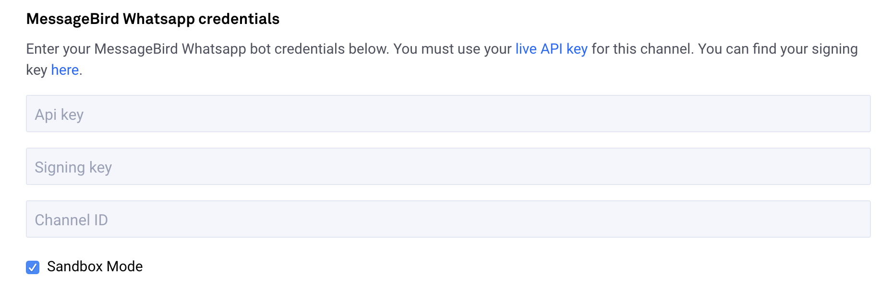
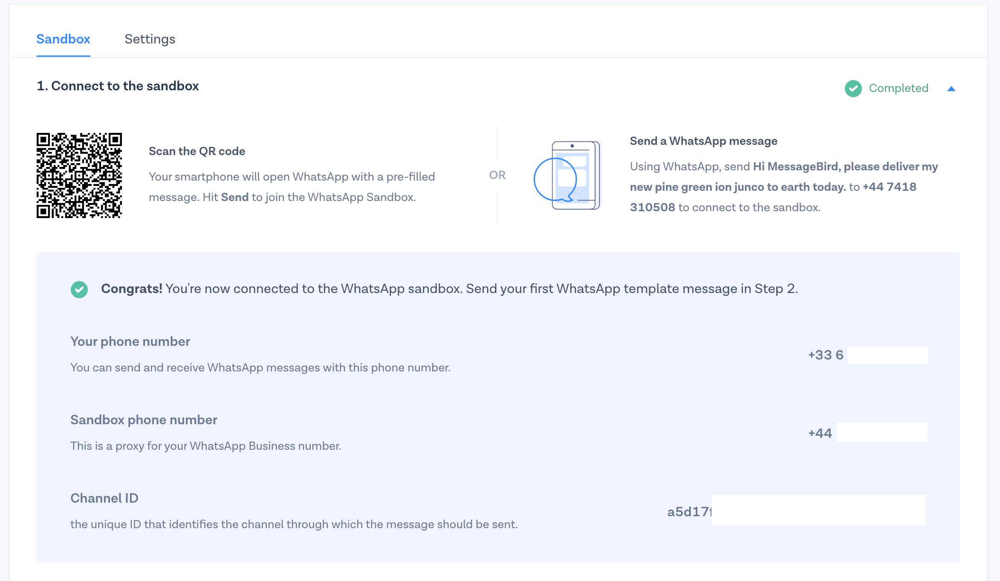

# Installation

## Prerequisites

There are two prerequisites for installing a Whatsapp bot in the CSML Studio.

1. you MUST have a verified Facebook Business account
2. you MUST have a MessageBird account

In case you have any question on how to get started with these two topics, please redirect your questions to MessageBird's support, as CSML Studio only connects to MessageBird's APIs.

Once you have created a MessageBird account, you can immediately connect your bot in MessageBird's free Whatsapp "sandbox", which allows you to send and receive messages on Whatsapp for free and test your chatbot.


Please refer to MessageBird's documentation on [Getting Started with the Whatsapp Sandbox](https://developers.messagebird.com/docs/conversations/whatsapp/getting-started-sandbox/).


Only once your account has been approved by Facebook into the private beta of Whatsapp Business will you be able to connect your chatbot to your real Whatsapp Business account.


Registering your chatbot for production use on Whatsapp takes a few days. Please read MessageBird's documentation on [Getting Started with Whatsapp for Business](https://developers.messagebird.com/docs/conversations/whatsapp/getting-started-sandbox/).


## Connecting Whatsapp to CSML Studio

In your bot in CSML Studio, go to **Channels** &gt; **Connect a new channel,** then select **Whatsapp**.

In the next screen, enter a name and description for your channel \(it is purely informational and can be changed later\) then add your MessageBird credentials. You will need 3 pieces of information:

The API Key can be found in the [Developers &gt; API access panel](https://dashboard.messagebird.com/en/developers/access) \(you _must_ use the `live API key`\) and the Signing Key can be found in the [Developers &gt; API settings panel](https://dashboard.messagebird.com/en/developers/settings#).

The Channel ID will be given to you at the end of the setup process for the Whatsapp channel on MessageBird's dashboard.

If you are in Sandbox Mode, you need to scan the QR Code and initiate the conversation before you can get the Channel ID. In that case, leave the **Sandbox Mode** checkbox checked.

After you have completed this step, submit the new channel in CSML Studio and you are good to go! All messages sent from/to your Whatsapp number will be sent to your chatbot.

