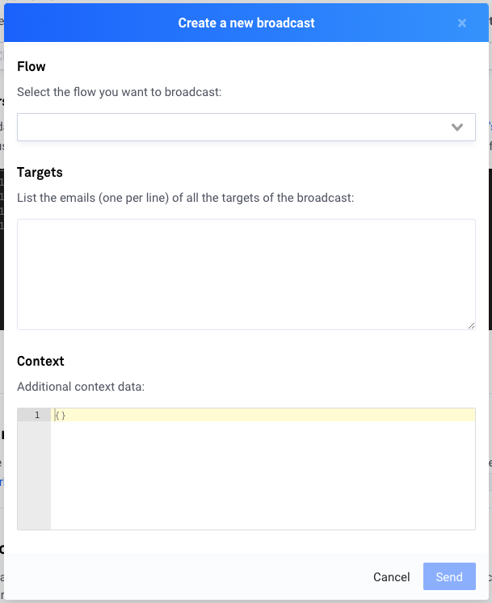

# Configuration

You can find similar configuration settings between [Messenger](../messenger/configuration.md) and Workchat channels. However, Workchat being a professional, internal-only communication channel, there are some additional options you can play with.

## Broadcast

The Broadcast feature allows you to trigger any flow for any given user or list of users. To use the broadcast feature, click on **Send broadcast** to open a configuration popup.

* Under **Flow**, select the flow you want to trigger
* Under **Targets**, list the emails \(one per line\) you want to receive the broadcast
* Under **Context**, you can optionally add any additional context that you want to set in the `_metadata` object for this broadcast

Once you hit **Send**, the broadcast will be sent immediately.


**For a very large number of targets, consider splitting into smaller sets.**

If the broadcast were to fail sending for any reason, you would not want to retry all the users again, as some may receive the broadcast twice!


