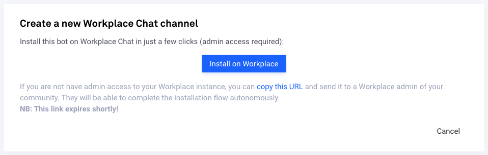
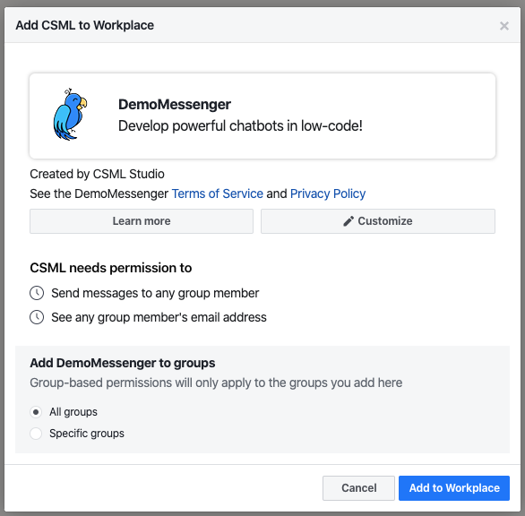

# Installation

Installing a Workchat bot on CSML Studio is very easy, as it only takes one click. However, it does require admin rights on your Workplace instance.

Go to **Channels** &gt; **Connect a new Channel** &gt; **Workplace Chat**.

If you are a Workplace admin, simply click on the button and follow the instructions. Otherwise, copy the URL just below and send it to a Workplace admin. They will be able to complete the installation flow autonomously, even if they do not have a CSML Studio account. After clicking on the button or link, you will be redirected to the app setup page on Workplace.

From there, you can configure its name, description and logo by clicking on **Customize**.

You can also set which groups will have access to the bot.

* If you want everyone to have access to this chatbot, leave the **All groups** box checked. 
* If you want to restrict access to the members of specific groups, check **Specific groups** instead, then select which groups are allowed to access the bot. Users that are not in one of the selected groups will not be able to search for or chat with the bot in Workchat.

Click on **Add to Workplace** and you are done!

