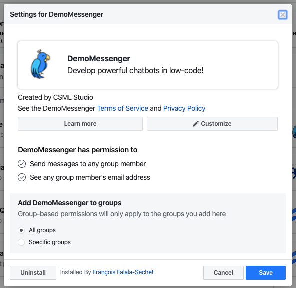

# Uninstallation

To uninstall a [Workplace Chat](./) channel, you need to delete the channel both on Workplace, and on CSML Studio. Only removing the channel on CSML Studio will leave the chatbot visible to Workplace users.

To remove the bot from Workplace, visit the [Workplace admin panel \(under Integrations\)](https://work.workplace.com/work/admin/apps/) and find your bot in the list of available bots.

Click on **Uninstall** then confirm. Your bot will immediately be removed from Workplace chat, however users that already talked to the bot will still be able to find their conversation history.

After this is done, you can safely remove the channel from CSML Studio as well.

