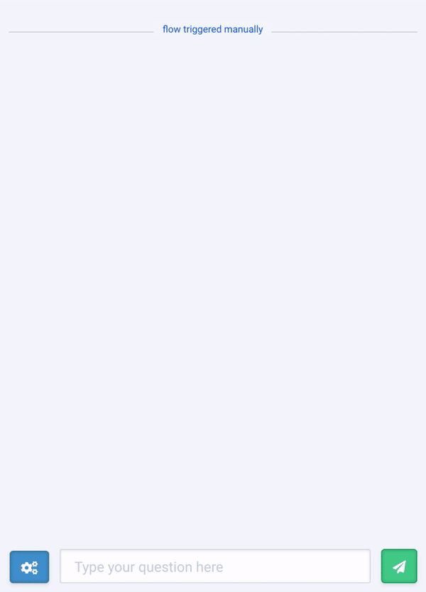
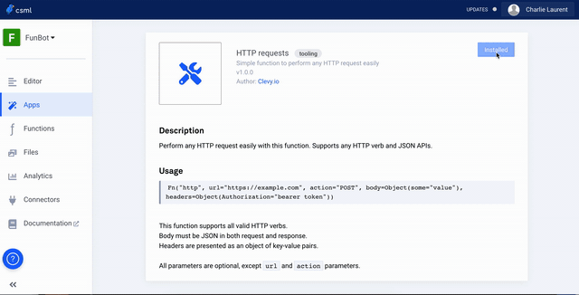

# Discover CSML

## How it works

**CSML \(Conversational Standard Meta Language\) is an open-source programming language dedicated to building chatbots**.

Written itself in Rust and fully Turing-complete, the CSML acts as a linguistic/syntactic abstraction layer, designed for humans who want to let other humans interact with any machine, in any setting. The syntax is designed to be learned in a matter of minutes, but also scales to any complexity of chatbot.

The CSML handles short and long-term memory slots, metadata injection, and can be plugged in with any external system by means of standard integrations or [custom APIs](../channels/api/), as well as integrated into other programming languages with parallelized runtimes.

To learn more about CSML, you can read this [article](https://medium.com/clevyio/announcing-csml-a-new-open-source-language-to-easily-build-full-featured-chatbots-3787e43ab707).

## Build your chatbot with CSML

You can easily experiment the language on the [CSML development studio](https://studio.csml.dev/), using a sample bot available in your library or by creating your own.

Each bot gives you a full access to the CSML framework - a set of specialized tools to make and customize your chatbots : editor, chatbox, apps, functions and files library, analytics and channels.

## **Create your conversational experiences**

You can create your conversation modifying an existing flow or [creating your own](create-your-first-bot.md).

A flow is a CSML file which contains several steps to be followed during a conversation with a user. The first instructions have to be placed in the start step, then you can move from a step to the next one using `goto stepname`, and finish the current conversation using `goto end`. Each step contains instructions on how to handle the interactions within the step: what to say, what to remember, where to go...

For the bot to say a sentence, you just need to use the keyword `say` followed by the [type of message]() you want to send.The keyword `say` allows:

* to display a message: text, questions, urls, components \(image, video, audio, buttons…\)
* to simulate behaviors, such as waiting time \(Wait\) or message composition \(Typing\)

## **Manage interactions**

Like a human, a chatbot is supposed to understand and react to messages sent by the user.

In a conversational logic, CSML allows the chatbot to wait for a user answer using the keyword `hold`, and interpret the expected user input \(called `event`\) to trigger an action.

Here is an example of a simple interaction where the bot is asking if the user likes guitar and waiting for two specific answers in order to trigger actions.

## **Use memories and local variables**

[Memory](https://docs.csml.dev/#memory-and-local-variables) is essential in the CSML logic. When two people are chatting, they constantly memorize information to be reused in future discussions.  
CSML provides two types of variables: local variables, with a very short life cycle, and persistent variables, called memories.

The memories are assigned as followed use the keyword `remember` and can be reused in every steps or in a future conversation, while the local variables are executed within one step, assigned with the `use` keyword.

You can output any variable into a string value with the double curly braces.

## **Connect apps and execute your own functions**

You can select an existing integration in the apps library or add your own function coded in any language. Find a few examples in our [GitHub repository](https://github.com/CSML-by-Clevy) and how to use functions in our [documentation.](https://docs.csml.dev/#custom-code-execution)

Once your function is uploaded, you can test it and call it into your CSML step.  
Here’s an example of a function available in the apps library, performing any HTTP request easily!

## **Deploy your chatbot**

Once your chatbot is ready to chat with your users, you can select the channel you want to connect on. For example, using the [CSML Studio](https://studio.csml.dev) you can connect your bots to Slack, Messenger, Whatsapp and other channels, or use the [CSML Client API](../channels/api/) to receive requests.

### **Ready to experiment CSML?**

