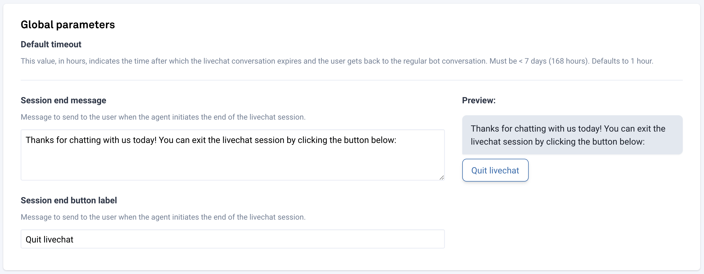

# Livechat

Chatbots are great, but sometimes your users will need some extra human help to go beyond what the chatbot can do. With CSML Studio, you can decide to bypass CSML and get your users to talk to a human agent instead! This is especially useful if the user needs help beyond what the chatbot can propose.

In order to get your users to talk to your human agents over livechat, you will need:

* a CSML chatbot and channel setup
* a supported Livechat platform
* a special flow to handle livechat requests

## Using Livechat in your bot

Using livechat in your flows is very easy. You can find an example implementation to import in CSML Studio [here on github](https://github.com/CSML-by-Clevy/CSML-livechat-demo).

To start a livechat session, the user needs to specifically request a livechat session with an available agent. This is achieved by getting the user to send the payload `LIVECHAT_SESSION_START`. When this happens, your CSML chatbot stops receiving events, and all messages are sent to the livechat backend of your choice.

To end a session, the user must send the payload `LIVECHAT_SESSION_END` . To do this, we recommend that your agent sends a "signing off" message containing that payload, which will be automatically transformed into an adequate button.

The session will also expire if no message is exchanged between the agent and the user within 60 minutes by default \(or the timeout configured in the livechat settings panel\). When that happens, an event is sent to your bot with the payload `LIVECHAT_SESSION_EXPIRED`. 

This example flow explains in detail the lifecycle of a livechat request:



## Configuring Livechat

We have several livechat solution providers, we encourage to try them all to see what fits your use case best! There is usually a free version available to try their product.

Once you have configured the livechat integration, you can also set other parameters:

* **Livechat session timeout**: this is the maximum amount of time a livechat session will remain active if no message is exchanged between the agent and the user. Any message sent from either side will reset that window. Default: 1hr.
* **Session end message and button label**: to end a session, the agent should send the user a `"LIVECHAT_SESSION_END"` event, which will be transposed to a text and button for the user to click on, to confirm they do want to end the livechat session. If the user does not click the button or says anything else, the session continues. This field helps you configure that message.

