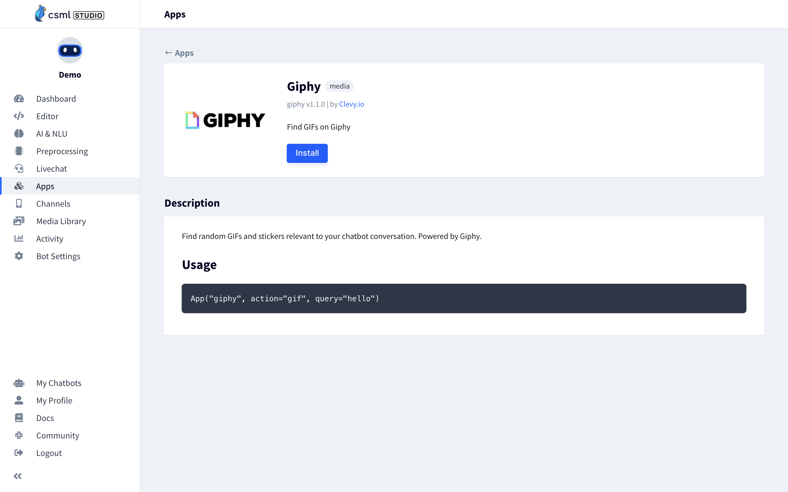

# CSML Integrations

[CSML Apps](https://www.csml.dev/integrations.html) are a great way to extend the capabilities of your CSML chatbot by integrating other products with your bot without writing any additional code. CSML Studio provides a number of ready-to-user integrations \(over 50 and growing!\), that make it possible to integrate your chatbot with the most popular services and applications on the market.

CSML Studio integrations are ready to use. To configure an integration, you only need to configure the required credentials for this app \(but some don't require any authentication!\). The app's description will have the information on how to get setup.

## Example: Giphy app

For instance, if you are looking to add some fun Gifs to your bot, you can try our [Giphy](https://giphy.com) integration. To get started, go to **Apps &gt; Available Integrations &gt; Giphy**.



Simply click on **Install**, and you are done! Some apps require credentials or API keys, but this one does not. If that's the case you are prompted to add _environment variables_ upon installation.

Then, to use the app in your code, you can use it like this:

```cpp
start:
  do gifs = App("giphy", action="gif", query="hello")
  say Image(gifs[0])
  goto end
```


## 

